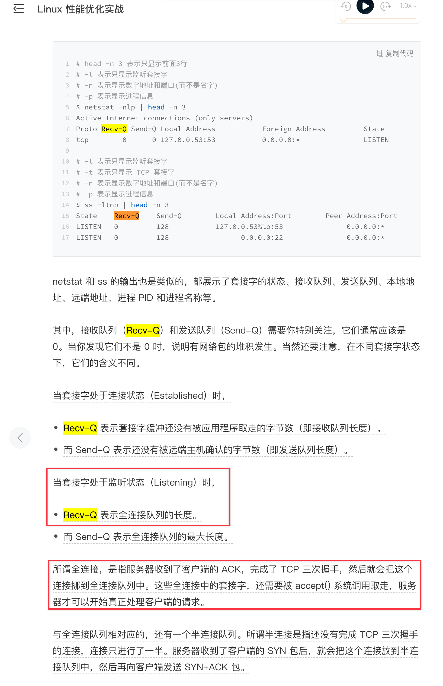

---
kind:
  - Troubleshooting
products:
  - Alauda Container Platform
  - Alauda DevOps
  - Alauda AI
  - Alauda Application Services
  - Alauda Service Mesh
  - Alauda Developer Portal
ProductsVersion:
  - 4.1.0,4.2.x
---
<!-- A type of document that involves encountering a fault, diagnosing it, performing root cause analysis, and providing solutions. -->

# habror core偶现与pgpool连接超时

访问harbor页面偶现内部错误红色报错 harbor-core连接pgpool svc地址偶现超时，频率约2小时一次 tcpdump显示SYN包收到ACK后，后续ACK未被确认，导致重传

## Cause
- pgpool并发进程数不足导致连接队列堆积，num_init_children默认值32与LISTEN数相同

## Resolution
- 修改postgresql cr annotations添加'skip-sync: true'
- 调整pgpool参数: num_init_children = 500, max_pool = 4
- 应用hotfix制品: build-harbor.alauda.cn/middleware/postgres-operator:fix-pgpool-config.2203071551

## [workaround]

## [Related Information]
**Screenshots**

- Environment: 3.6.2
- pgpool
- num_init_children
- max_pool
- skip-sync
- postgres-operator
- SYN-RCVD
- Recv-Q
- Component: harbor
- Page ID: 112054444
- Original Title: habror core偶现与pgpool连接超时
