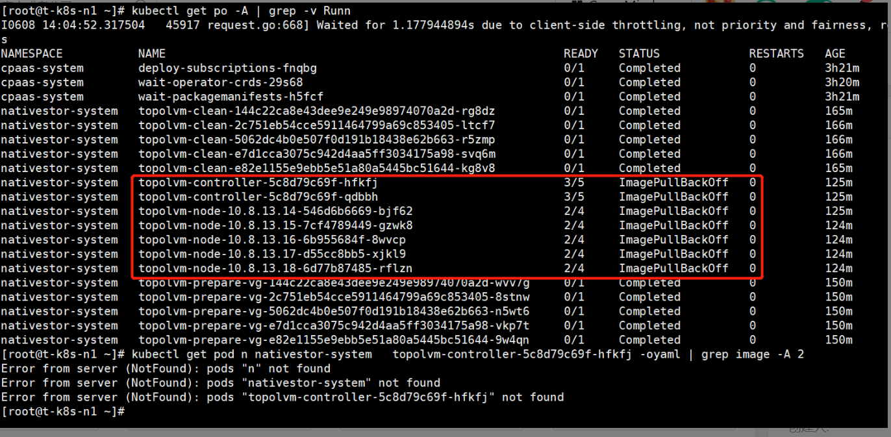
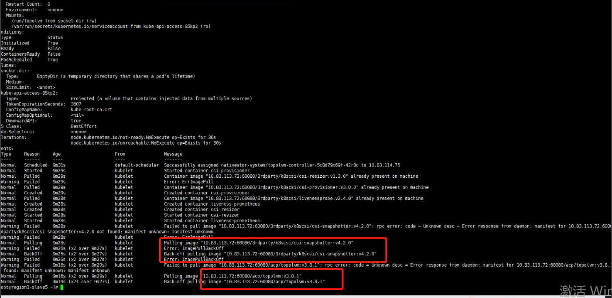
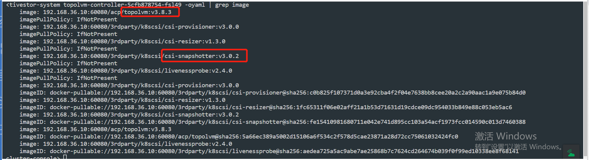

---
kind:
  - Troubleshooting
products:
  - Alauda Container Platform
  - Alauda DevOps
  - Alauda AI
  - Alauda Application Services
  - Alauda Service Mesh
  - Alauda Developer Portal
ProductsVersion:
  - 4.1.0,4.2.x
---
<!-- A type of document that involves encountering a fault, diagnosing it, performing root cause analysis, and providing solutions. -->

# 3.8.1

部署topolvm报错找不到镜像 镜像拉取版本错误

## Cause
- UI清理操作同时删除了后端存储配置
- 重新部署时使用了旧集群配置中的错误镜像版本

## Resolution
- 手动修改yaml镜像版本为csi-snapshotter:v3.0.2和topolvm:3.8.3
- 卸载topolvm-operator并删除其subscription

## [workaround]

## [Related Information]
**Screenshots**

- Environment: ACP 3.8.x
- topolvm-operator
- subscription
- csi-snapshotter
- topolvm
- configmap
- Component: Harbor
- Page ID: 115532013
- Original Title: 3.8.1-部署topolvm失败-镜像拉取版本错误
