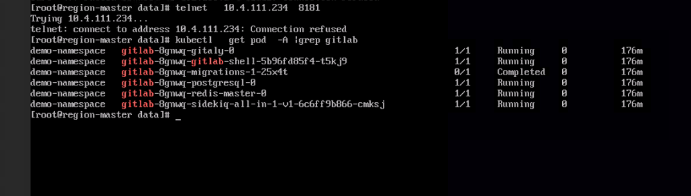
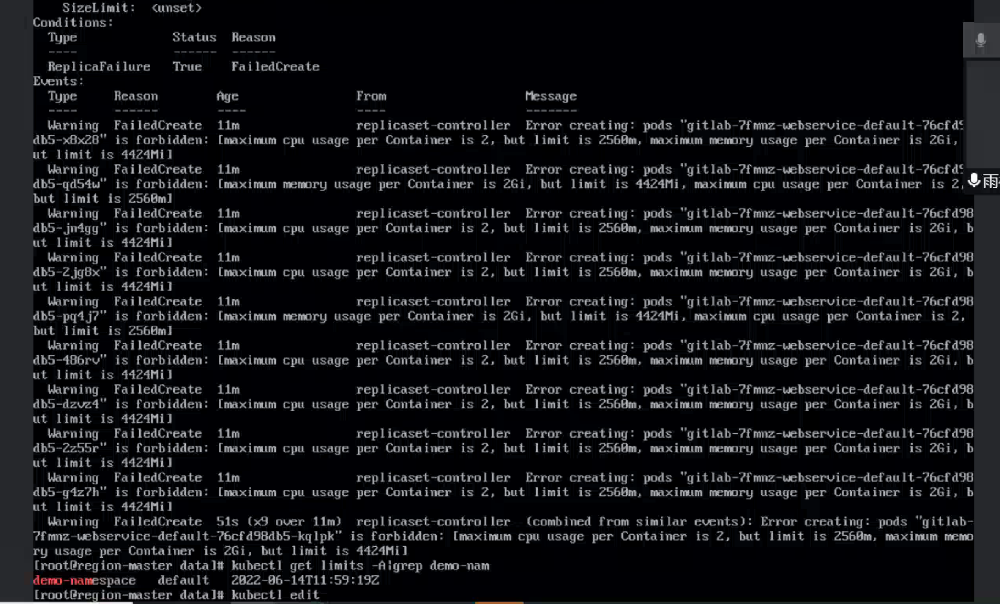

---
kind:
  - Troubleshooting
products:
  - Alauda Container Platform
  - Alauda DevOps
  - Alauda AI
  - Alauda Application Services
  - Alauda Service Mesh
  - Alauda Developer Portal
ProductsVersion:
  - 4.1.0,4.2.x
---
<!-- A type of document that involves encountering a fault, diagnosing it, performing root cause analysis, and providing solutions. -->

# 全新部署的工具链有pod组件没有启动

部署后缺少gitlab-webservice组件 sonar组件存在相同问题 Deployment存在但Pod未启动

## Cause
- namespace的limitsrange限制pod最大内存配额为2048Mi
- gitlab-webservice内存限制设置为4Gi导致调度失败

## Resolution
- 调整工具链组件资源限制使其符合namespace配额
- 修改namespace的limitsrange配置放宽内存限制

## [workaround]

## [Related Information]
**Screenshots**

- Environment: TKE 3.0以上版本，涉及组件：gitlab/jenkins/harbor/sonar
- gitlab-webservice
- sonar
- deployments
- replicasets
- limitsrange
- namespace资源配额
- Component: harbor
- Page ID: 115536867
- Original Title: 全新部署的工具链有pod组件没有启动
