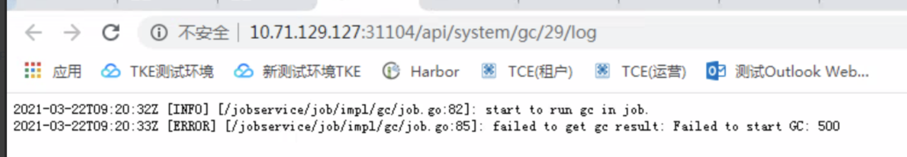
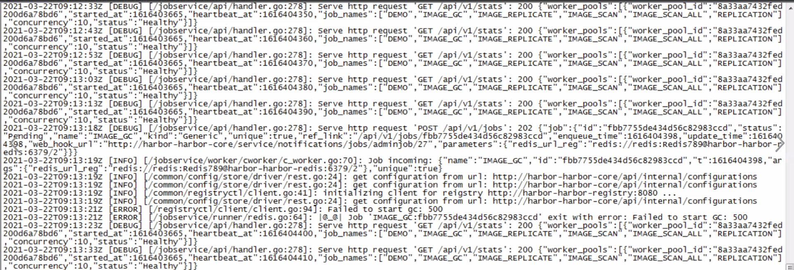

---
kind:
  - Troubleshooting
products:
  - Alauda Container Platform
  - Alauda DevOps
  - Alauda AI
  - Alauda Application Services
  - Alauda Service Mesh
  - Alauda Developer Portal
ProductsVersion:
  - 4.1.0,4.2.x
---
<!-- A type of document that involves encountering a fault, diagnosing it, performing root cause analysis, and providing solutions. -->

# harbor镜像仓库无法进行垃圾清理

harbor镜像仓库无法进行垃圾清理 执行垃圾清理删除镜像报错500 jobservice日志存在特定报错

## Cause
- Harbor自动垃圾收集机制异常

## Resolution
- 手动在registry服务pod执行命令: registry garbage-collect --delete-untagged=true /etc/registry/config.yml

## [workaround]

## [Related Information]
**Screenshots**

- Environment: ACE2.9
- registry
- jobservice
- /etc/registry/config.yml
- gc日志
- Component: harbor
- Page ID: 115538460
- Original Title: harbor镜像仓库无法进行垃圾清理
