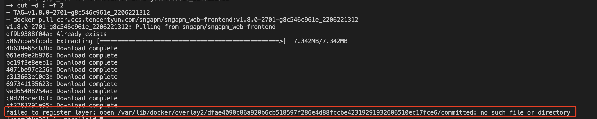

---
kind:
  - Troubleshooting
products:
  - Alauda Container Platform
  - Alauda DevOps
  - Alauda AI
  - Alauda Application Services
  - Alauda Service Mesh
  - Alauda Developer Portal
ProductsVersion:
  - 4.1.0,4.2.x
---
<!-- A type of document that involves encountering a fault, diagnosing it, performing root cause analysis, and providing solutions. -->

# 镜像上传下载报错

镜像上传报错-no such file or directory

## Cause
- 部分节点存在磁盘异常导致文件访问失败

## Resolution
- 重启异常节点使磁盘重新挂载

## [workaround]

## [Related Information]
**Screenshots**

- Environment: 通用版本，镜像仓库环境
- 镜像仓库
- Component: Harbor
- Page ID: 119079877
- Original Title: 镜像上传下载报错-no such file or directory
