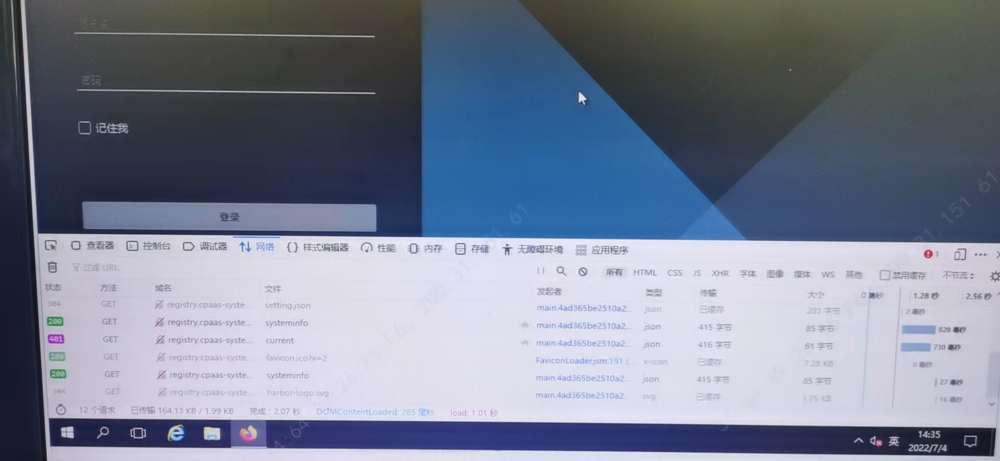
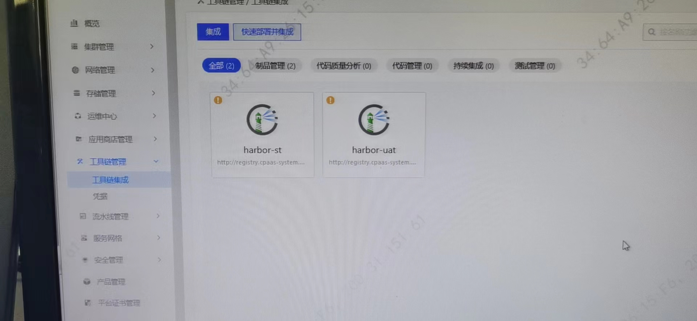

---
kind:
  - Troubleshooting
products:
  - Alauda Container Platform
  - Alauda DevOps
  - Alauda AI
  - Alauda Application Services
  - Alauda Service Mesh
  - Alauda Developer Portal
ProductsVersion:
  - 4.1.0,4.2.x
---
<!-- A type of document that involves encountering a fault, diagnosing it, performing root cause analysis, and providing solutions. -->

# harbor界面登录报错界面无反馈

harbor界面登录报错界面无反馈 服务状态正常但无法正常访问

## Cause
- 多个harbor实例使用相同的ingress url导致冲突

## Resolution
- 重新部署存在冲突的harbor实例并更改对外暴露地址

## [workaround]

## [Related Information]
**Screenshots**

- Environment: 通用
- harbor-core
- ingress
- kubernetes集群部署
- harbor实例
- Component: harbor
- Page ID: 119088435
- Original Title: harbor界面登录报错界面无反馈
