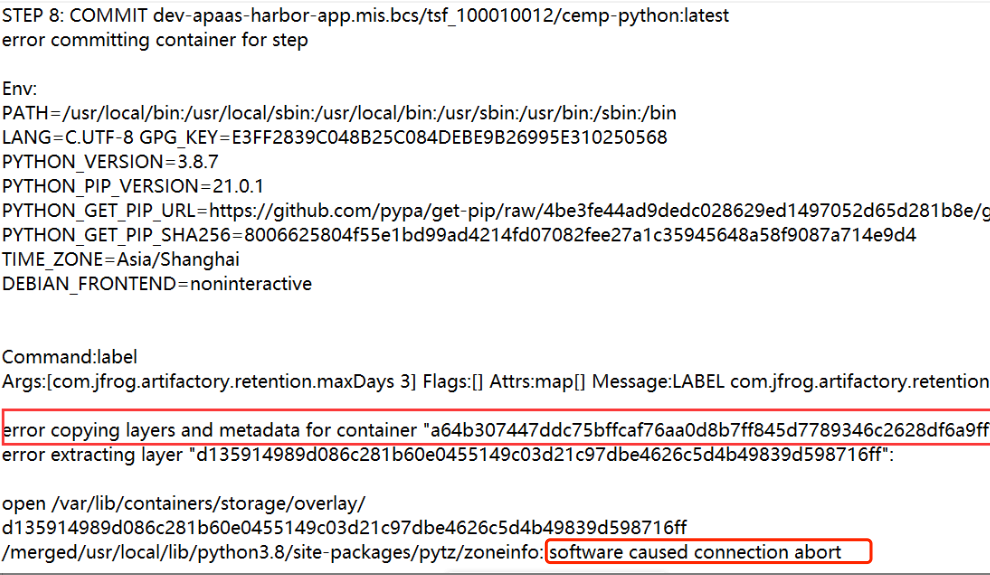

---
kind:
  - Troubleshooting
products:
  - Alauda Container Platform
  - Alauda DevOps
  - Alauda AI
  - Alauda Application Services
  - Alauda Service Mesh
  - Alauda Developer Portal
ProductsVersion:
  - 4.1.0,4.2.x
---
<!-- A type of document that involves encountering a fault, diagnosing it, performing root cause analysis, and providing solutions. -->

# buildah构建镜像报错

buildah构建镜像时出现'software caused connection abort'错误 使用预装依赖的自建ARM基础镜像构建失败 更换官方干净python镜像后构建成功

## Cause
- 基础镜像内容与容器存储驱动存在兼容性问题
- 可能涉及fuse-overlayfs组件bug(参考github issue 293)
- 镜像层过大可能引发存储驱动异常

## Resolution
- 更换为干净的官方基础镜像
- 检查节点内核版本与docker存储驱动配置
- 监控基础镜像体积对构建过程的影响

## [workaround]

## [Related Information]
**Screenshots**

- Environment: TKE 3.6
- buildah
- fuse-overlayfs
- harbor
- docker存储驱动配置
- Component: harbor
- Page ID: 120102349
- Original Title: buildah构建镜像报错
