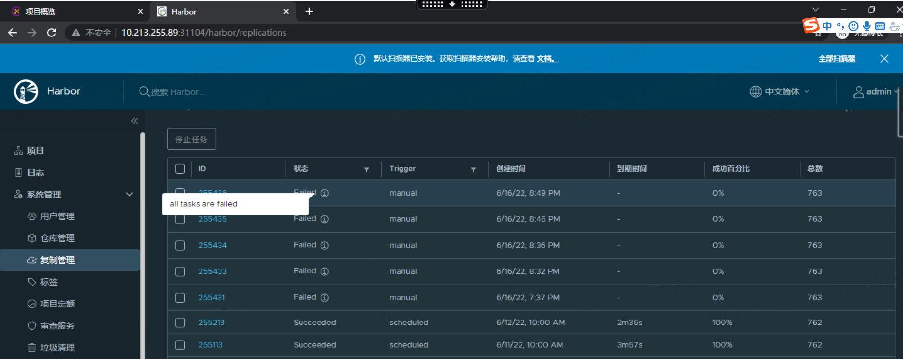
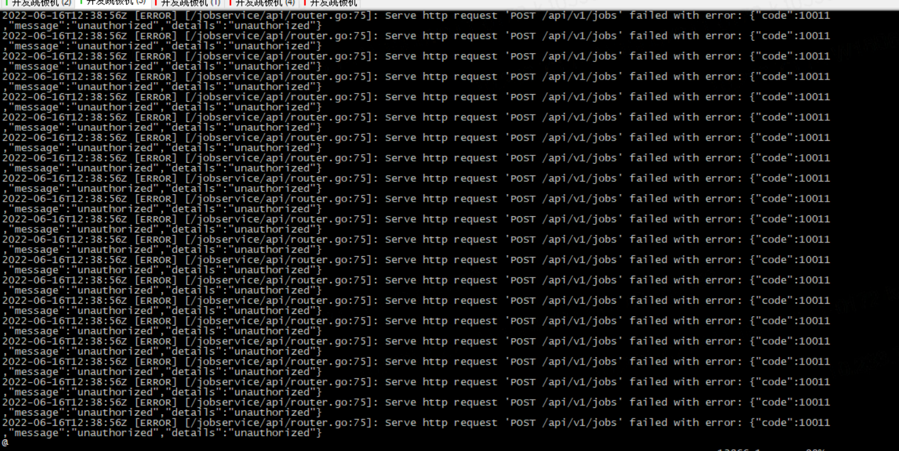

---
kind:
  - Troubleshooting
products:
  - Alauda Container Platform
  - Alauda DevOps
  - Alauda AI
  - Alauda Application Services
  - Alauda Service Mesh
  - Alauda Developer Portal
ProductsVersion:
  - 4.1.0,4.2.x
---
<!-- A type of document that involves encountering a fault, diagnosing it, performing root cause analysis, and providing solutions. -->

# harbor镜像同步失败

harbor镜像同步报错all task are filed

## Cause

## Resolution
- 重启harbor-jobservice

## [workaround]

## [Related Information]
**Screenshots**

- Environment: TKE 3.4.2
- harbor-jobservice
- Component: harbor
- Page ID: 120102371
- Original Title: harbor镜像同步失败
