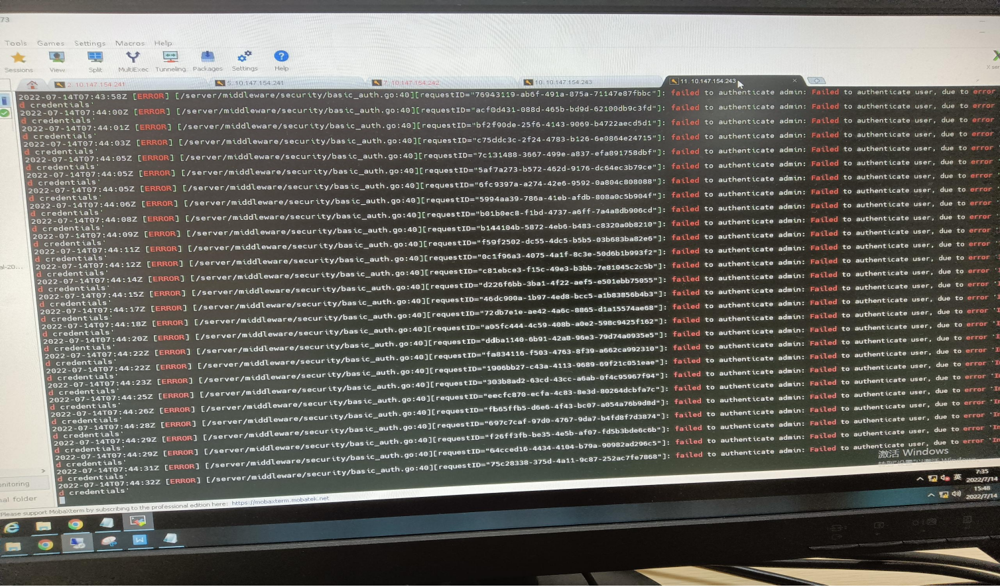
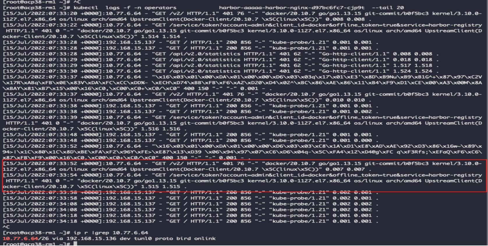
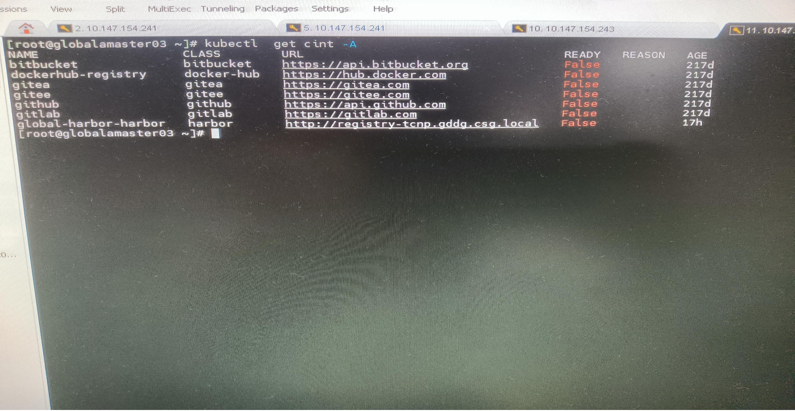
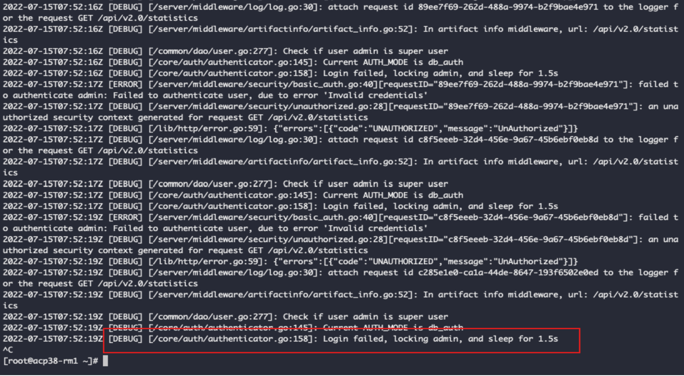
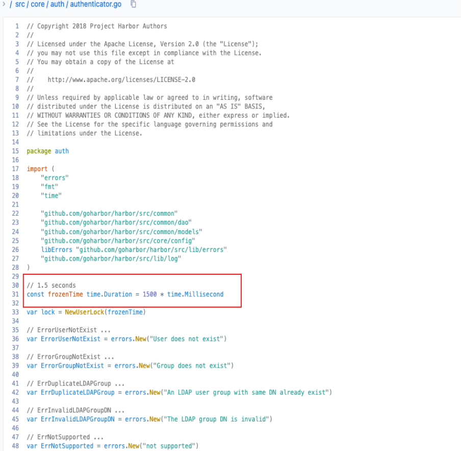

---
kind:
  - Troubleshooting
products:
  - Alauda Container Platform
  - Alauda DevOps
  - Alauda AI
  - Alauda Application Services
  - Alauda Service Mesh
  - Alauda Developer Portal
ProductsVersion:
  - 4.1.0,4.2.x
---
<!-- A type of document that involves encountering a fault, diagnosing it, performing root cause analysis, and providing solutions. -->

# harbor修改密码后harbor锁定

修改Harbor密码后提示用户名或密码不正确，多次尝试后可登录

## Cause
- global集群中的katanomi组件使用旧密码持续请求Harbor，触发Harbor的lock函数（锁定1.5秒）

## Resolution
- 更新集群内所有使用Harbor的secret凭据，执行脚本遍历并检查旧密码：
- kubectl get secret -A >/tmp/1
- cat /tmp/1|awk '{print "bash 1.sh",$1,$2}'|bash >/tmp/result.txt
- 检查Harbor core日志确认无授权失败报错
- 建议使用普通用户（非admin）集成到devops功能

## [workaround]

## [Related Information]
**Screenshots**

- Environment: TKE 3.4以上
- Harbor secret
- katanomi组件
- Harbor login函数锁定机制
- Harbor core日志
- Harbor nginx日志
- Component: harbor
- Page ID: 120110285
- Original Title: harbor修改密码后harbor锁定
