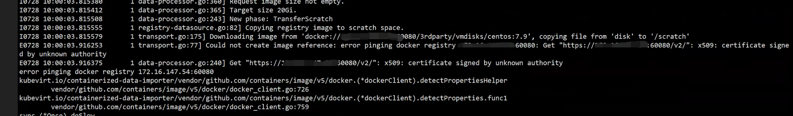

---
kind:
  - Troubleshooting
products:
  - Alauda Container Platform
  - Alauda DevOps
  - Alauda AI
  - Alauda Application Services
  - Alauda Service Mesh
  - Alauda Developer Portal
ProductsVersion:
  - 4.1.0,4.2.x
---
<!-- A type of document that involves encountering a fault, diagnosing it, performing root cause analysis, and providing solutions. -->

# kubevirt创建虚机无法启动

虚机状态异常，数据盘（DataVolume）报错 虚机启动相关pod持续重启 pod日志显示访问平台60080镜像仓库认证失败

## Cause
- HyperConverged未正确配置平台镜像仓库地址

## Resolution
- 检查HyperConverged配置的镜像仓库地址（含60080端口）
- 修正配置后重建虚机启动pod

## [workaround]

## [Related Information]
**Screenshots**

- Environment: 3.8.x
- HyperConverged
- DataVolume
- 60080
- 镜像仓库地址
- Component: Harbor
- Page ID: 120114102
- Original Title: kubevirt创建虚机无法启动
