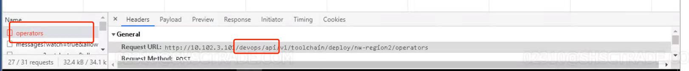
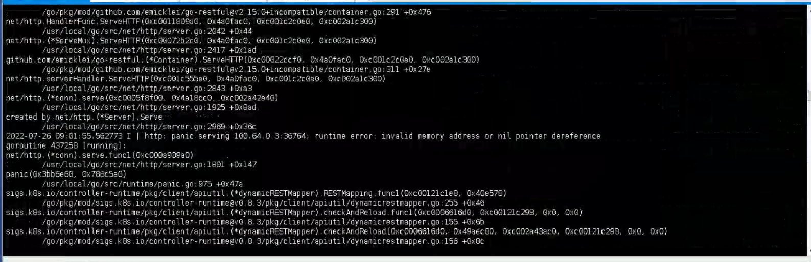

---
kind:
  - Troubleshooting
products:
  - Alauda Container Platform
  - Alauda DevOps
  - Alauda AI
  - Alauda Application Services
  - Alauda Service Mesh
  - Alauda Developer Portal
ProductsVersion:
  - 4.1.0,4.2.x
---
<!-- A type of document that involves encountering a fault, diagnosing it, performing root cause analysis, and providing solutions. -->

# 3.8.1

容器平台打开工具链集成页报错502

## Cause
- devops-api在处理harbor接口时发生panic

## Resolution
- 重启devops-api服务

## [workaround]

## [Related Information]
**Screenshots**

- Environment: TKE 3.8.1
- harbor工具链集成
- devops-api
- Component: harbor
- Page ID: 120121991
- Original Title: 3.8.1-harbor工具链集成页面报错502
