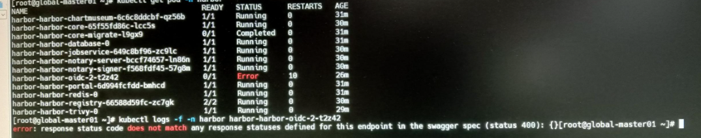
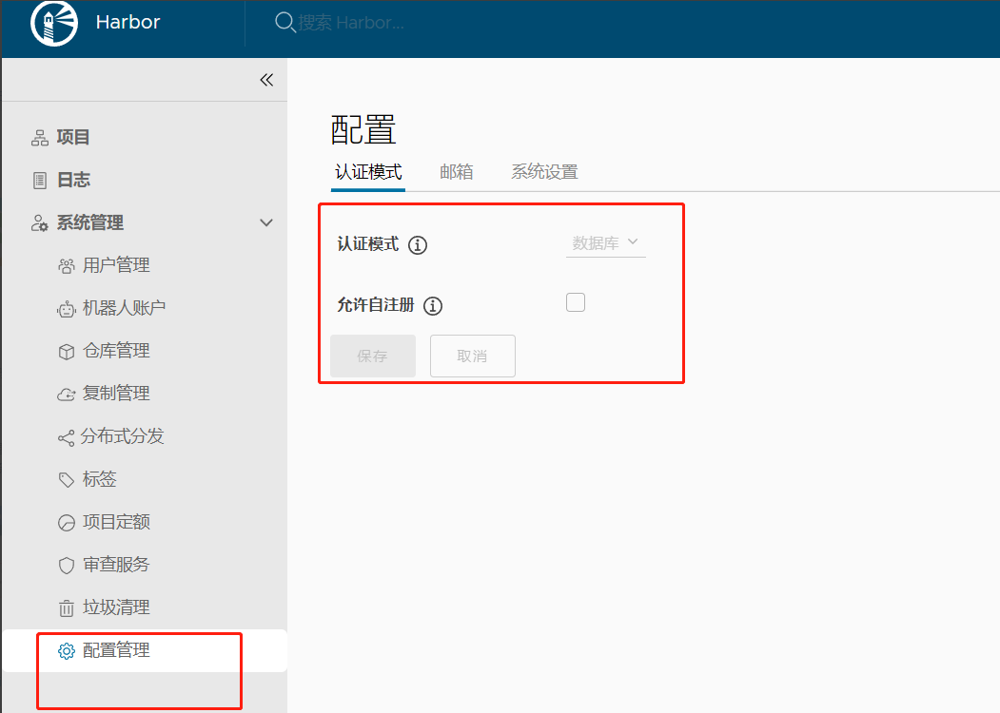
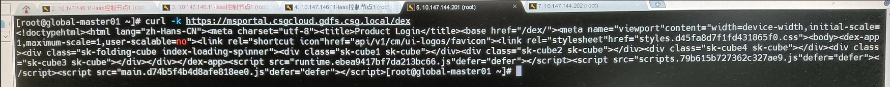
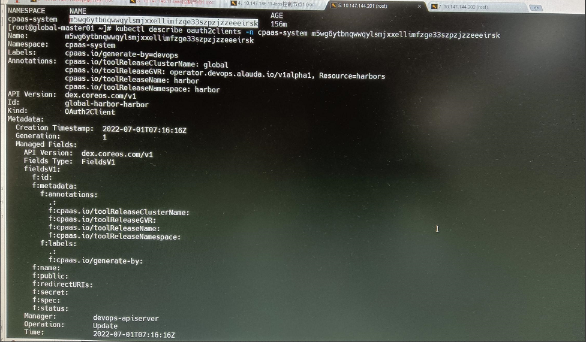
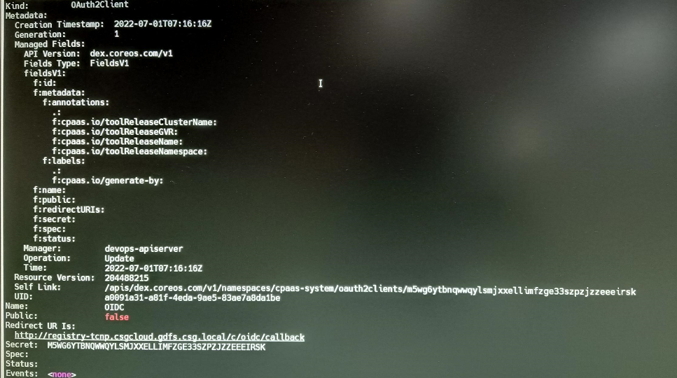
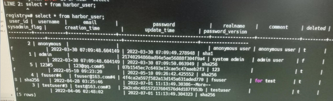

---
kind:
  - Troubleshooting
products:
  - Alauda Container Platform
  - Alauda DevOps
  - Alauda AI
  - Alauda Application Services
  - Alauda Service Mesh
  - Alauda Developer Portal
ProductsVersion:
  - 4.1.0,4.2.x
---
<!-- A type of document that involves encountering a fault, diagnosing it, performing root cause analysis, and providing solutions. -->

# harbor开启sso后，oidc的pod无法启动

oidc的pod一直处在crashloopbackoff状态 oidc配置未正确写入到harbor

## Cause
- harbor中已存在非管理员和匿名用户导致oidc账号对接信息无法写入

## Resolution
- kubectl exec -ti -n operators harbor-harbor-database-0 bash
- 执行select * from harbor_user; 查看用户
- 保留前两个用户，删除其他非管理员和匿名用户

## [workaround]

## [Related Information]
**Screenshots**

3、尝试curl 访问acp 平台dex 服务的返回

- Environment: Harbor 3.6.x, 3.8.x
- harbor_user
- oauth2clients
- oidc_client_secret
- /api/v2.0/system/oidc/ping
- Component: harbor
- Page ID: 124682395
- Original Title: harbor开启sso后，oidc的pod无法启动
