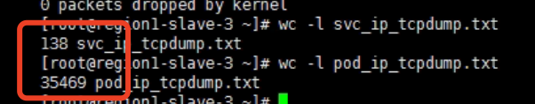

---
kind:
  - Troubleshooting
products:
  - Alauda Container Platform
  - Alauda DevOps
  - Alauda AI
  - Alauda Application Services
  - Alauda Service Mesh
  - Alauda Developer Portal
ProductsVersion:
  - 4.1.0,4.2.x
---
<!-- A type of document that involves encountering a fault, diagnosing it, performing root cause analysis, and providing solutions. -->

# Underlay 通过 Service IP 访问 Pod 带宽极低

通过 Service IP 访问 Pod 带宽极低（400k/s） 通过 Pod IP 访问带宽正常（110M/s） harbor 拉取镜像超时（镜像不足 100M）

## Cause
- OVN LB 对 Service IP 的 DNAT 未修改 dst MAC，导致网络包仍发往物理网关
- 物理网关开启 ip redirect（ICMP 重定向）功能导致带宽下降

## Resolution
- 关闭物理网关的 ip redirect 功能

## [workaround]

## [Related Information]
**Screenshots**

- Environment: ovn underlay
- Service IP
- Pod IP
- OVN LB
- DNAT
- 物理网关
- ICMP 重定向
- Component: harbor
- Page ID: 127426806
- Original Title: Underlay 通过 Service IP 访问 Pod 带宽极低
