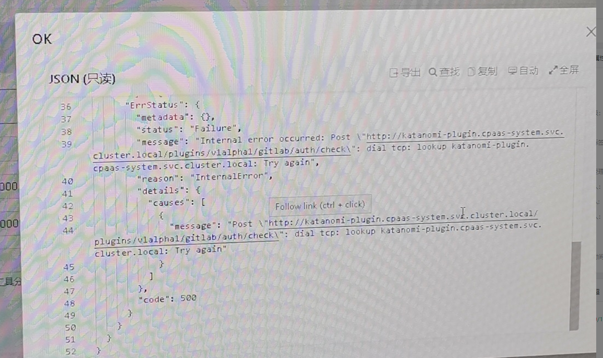

---
kind:
  - Troubleshooting
products:
  - Alauda Container Platform
  - Alauda DevOps
  - Alauda AI
  - Alauda Application Services
  - Alauda Service Mesh
  - Alauda Developer Portal
ProductsVersion:
  - 4.1.0,4.2.x
---
<!-- A type of document that involves encountering a fault, diagnosing it, performing root cause analysis, and providing solutions. -->

# 工具链集成无法绑定凭证

Post "<http://katanomi-plugin.cpaassystem.svc.cluster.local/plugins/vlalpha1/harbor/auth/check>": dial tcp: lookup katanomi-plugin.cpaas-system.svc.cluster.local: Try again

## Cause
- 节点关闭search域后容器未及时更新resolv配置

## Resolution
- 重启katanomi-plugin和katanomi-api容器
- 建议重启所有容器使新resolv配置生效

## [workaround]

## [Related Information]
**Screenshots**

- Environment: 3.8,3.10
- katanomi-plugin
- katanomi-api
- /etc/resolv.conf
- search域
- Component: harbor
- Page ID: 127429797
- Original Title: 工具链集成无法绑定凭证
