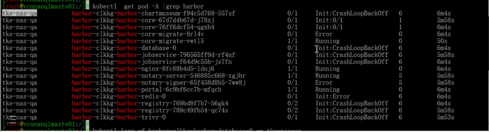

---
kind:
  - Troubleshooting
products:
  - Alauda Container Platform
  - Alauda DevOps
  - Alauda AI
  - Alauda Application Services
  - Alauda Service Mesh
  - Alauda Developer Portal
ProductsVersion:
  - 4.1.0,4.2.x
---
<!-- A type of document that involves encountering a fault, diagnosing it, performing root cause analysis, and providing solutions. -->

# harbor部署失败处于init状态

harbor部署失败，容器全部处于init状态 initcontainer阶段在存储目录中执行chown赋权失败

## Cause
- NFS存储类权限配置异常
- Windows NFS服务器未配置no_root_squash参数

## Resolution
- 在NFS服务器端开启no_root_squash配置（Windows/Linux均适用）

## [workaround]
- 改用hostpath存储方式部署

## [Related Information]
**Screenshots**

- Environment: Harbor部署环境使用Windows NFS服务器
- nfs存储类
- initcontainer
- chown
- no_root_squash配置
- Component: harbor
- Page ID: 127429875
- Original Title: harbor部署失败处于init状态
