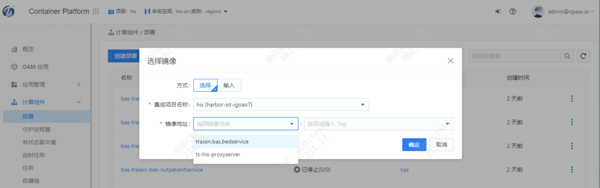
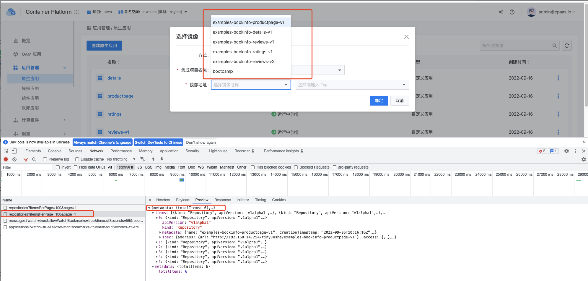

---
kind:
  - Troubleshooting
products:
  - Alauda Container Platform
  - Alauda DevOps
  - Alauda AI
  - Alauda Application Services
  - Alauda Service Mesh
  - Alauda Developer Portal
ProductsVersion:
  - 4.1.0,4.2.x
---
<!-- A type of document that involves encountering a fault, diagnosing it, performing root cause analysis, and providing solutions. -->

# 创建应用无法选择到镜像

创建应用无法下拉所有镜像

## Cause
- 镜像数目超过百条导致展示问题

## Resolution
- 确认产品漏洞并修复

## [workaround]

## [Related Information]
**Screenshots**

- Environment: TKE 3.8
- harbor仓库
- 镜像选择功能
- repositories接口
- Component: harbor
- Page ID: 130576933
- Original Title: 创建应用无法选择到镜像
