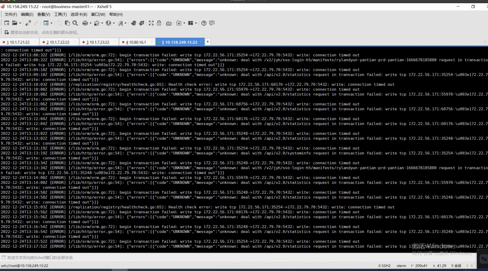
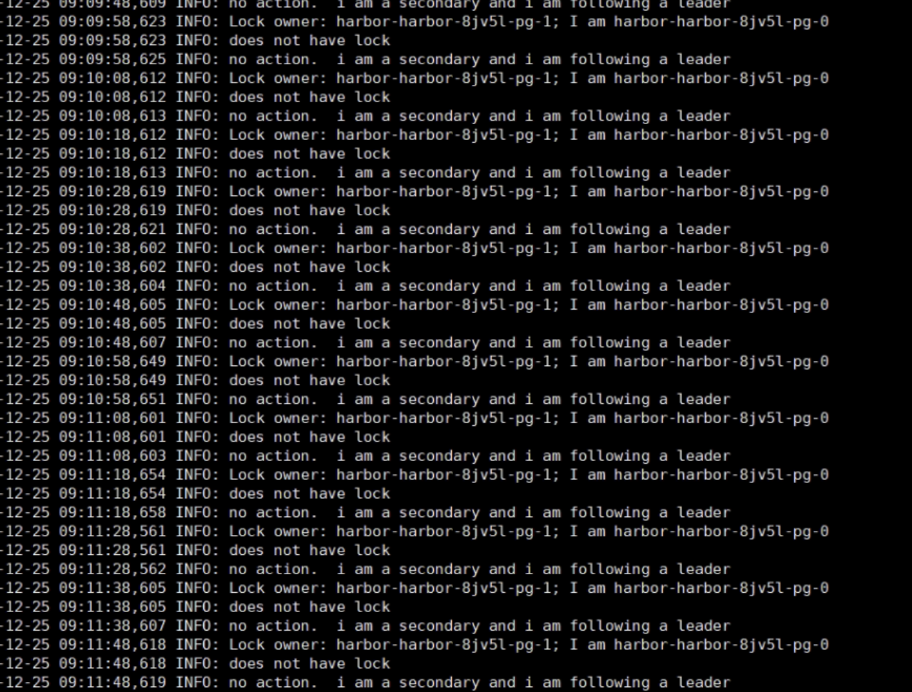
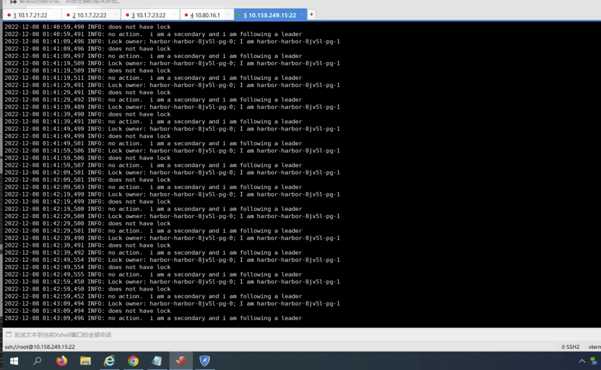

---
kind:
  - Troubleshooting
products:
  - Alauda Container Platform
  - Alauda DevOps
  - Alauda AI
  - Alauda Application Services
  - Alauda Service Mesh
  - Alauda Developer Portal
ProductsVersion:
  - 4.1.0,4.2.x
---
<!-- A type of document that involves encountering a fault, diagnosing it, performing root cause analysis, and providing solutions. -->

# 高可用harbor无法访问

访问harbor无法连接 core日志显示连接pg超时 pg两个节点的日志显示都认为对方是leader

## Cause
- pg副本间出现脑裂（split-brain），导致双主状态

## Resolution
- 手动重启pg集群

## [workaround]

## [Related Information]
**Screenshots**

- Environment: 3.8
- postgresql
- harbor-core
- 高可用配置
- Component: harbor
- Page ID: 133094429
- Original Title: devops-高可用harbor无法访问
