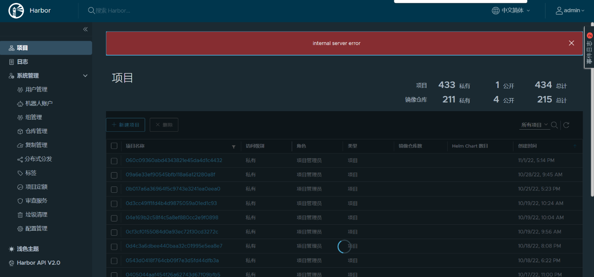
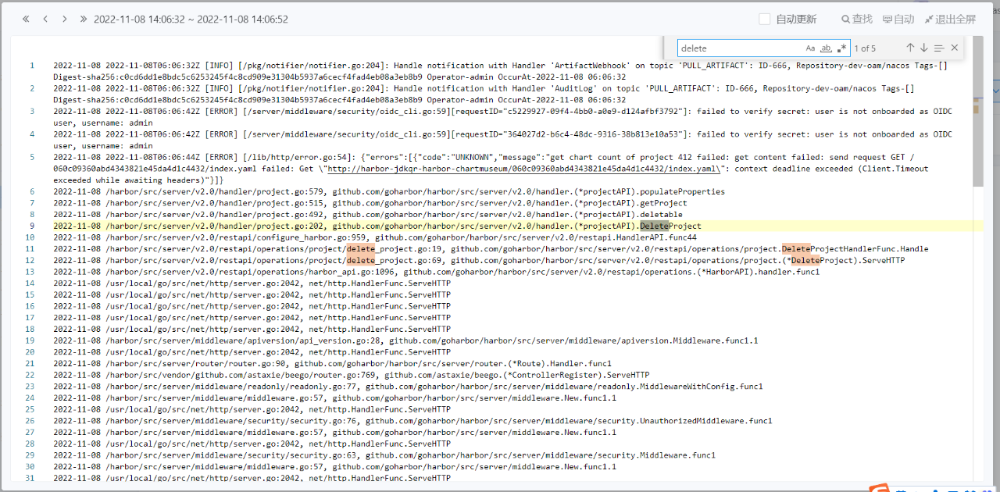
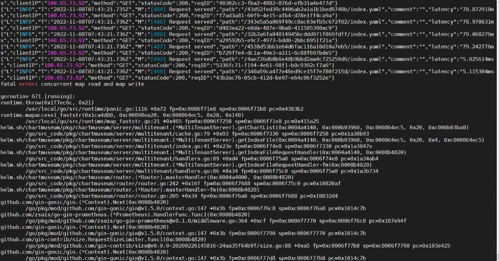

---
kind:
  - Troubleshooting
products:
  - Alauda Container Platform
  - Alauda DevOps
  - Alauda AI
  - Alauda Application Services
  - Alauda Service Mesh
  - Alauda Developer Portal
ProductsVersion:
  - 4.1.0,4.2.x
---
<!-- A type of document that involves encountering a fault, diagnosing it, performing root cause analysis, and providing solutions. -->

# harbor项目过多导致harbor不稳定

harbor-core报错日志 harbor-chartmuseum组件持续启动失败且pg报错 界面点击进入项目无反应

## Cause
- harbor存在400多个项目导致chartmuseum异常

## Resolution
- 在harbor-core的configmap添加skip-sync: "true"注释
- 将harbor-core的configmap中with_chartmuseum注释改为false
- 重启harbor-core的pod
- 将chartmuseum副本数设置为0
- 在chartmuseum的deployment添加skip-sync: "true"注释

## [workaround]
- 下架chartmuseum组件并删除无用project后再重新上架

## [Related Information]
**Screenshots**

- Environment: TKE 3.9
- harbor-core
- harbor-chartmuseum
- skip-sync
- with_chartmuseum
- configmap
- kubectl get cm -n  harbor-ns
- kubectl edit deploy chartmuseum-xxx -n xxx
- Component: harbor
- Page ID: 133094779
- Original Title: harbor项目过多导致harbor不稳定
