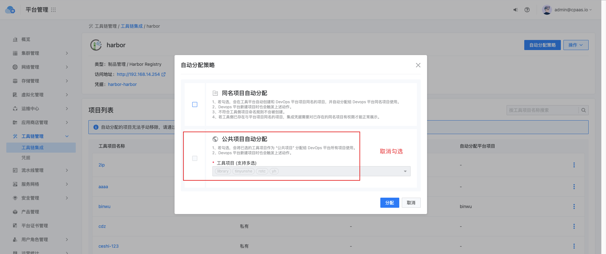

---
kind:
  - Troubleshooting
products:
  - Alauda Container Platform
  - Alauda DevOps
  - Alauda AI
  - Alauda Application Services
  - Alauda Service Mesh
  - Alauda Developer Portal
ProductsVersion:
  - 4.1.0,4.2.x
---
<!-- A type of document that involves encountering a fault, diagnosing it, performing root cause analysis, and providing solutions. -->

# harbor项目无法分配给平台项目

harbor无法绑定新的项目 报错 failed calling webhook "mclusterintegration.kb.io": received invalid webhook response: expected response.uid="9da3f9d3-e953-43b6-956a-0228080c9eb4", got ""

## Cause
- 平台版本升级导致harbor自动分配项目的数据处理存在兼容性问题

## Resolution
- 升级平台至修复版本3.11以上

## [workaround]
- 取消自动分配项目->手动绑定项目->重新开启自动分配项目

## [Related Information]
**Screenshots**

‘
- Environment: 3.6升级到3.8环境
- mclusterintegration.kb.io
- Component: harbor
- Page ID: 136520822
- Original Title: harbor项目无法分配给平台项目
