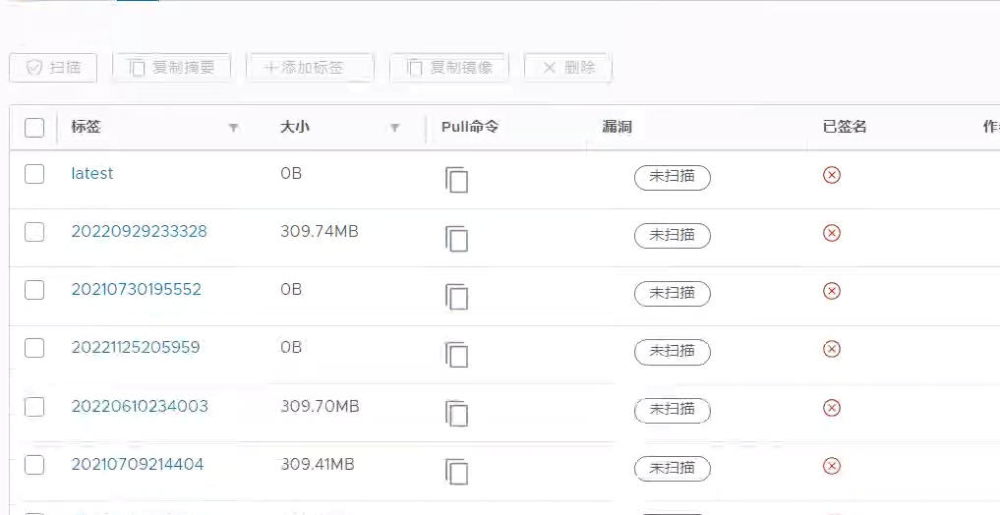

---
kind:
  - Troubleshooting
products:
  - Alauda Container Platform
  - Alauda DevOps
  - Alauda AI
  - Alauda Application Services
  - Alauda Service Mesh
  - Alauda Developer Portal
ProductsVersion:
  - 4.1.0,4.2.x
---
<!-- A type of document that involves encountering a fault, diagnosing it, performing root cause analysis, and providing solutions. -->

# harbor镜像仓库出现0B镜像无法删除

harbor镜像仓库出现0B镜像无法删除

## Cause
- harbor-registry数据目录存储空间已满导致上传新镜像时产生0B镜像

## Resolution
- 1. 扩容harbor磁盘空间
- 2. 使用docker tag命令创建新镜像并复用0B镜像的tag
- 3. 执行docker push覆盖原有0B镜像
- 4. 删除被覆盖的镜像

## [workaround]

## [Related Information]
**Screenshots**

- Environment: harbor 1.x
- harbor-registry数据目录
- Component: harbor
- Page ID: 140812792
- Original Title: harbor镜像仓库出现0B镜像无法删除
