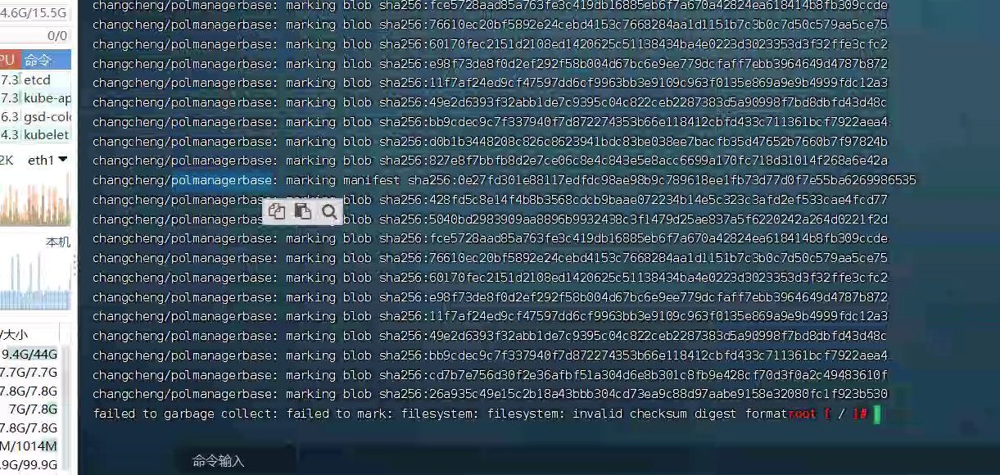
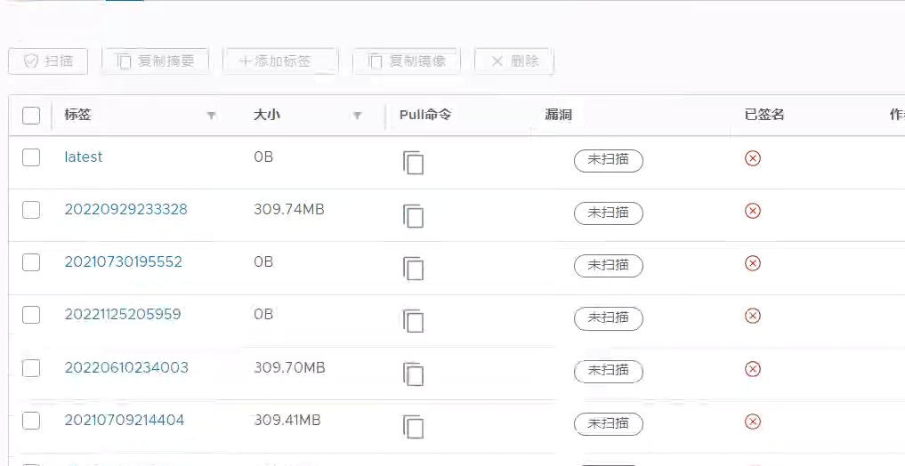

---
kind:
  - Troubleshooting
products:
  - Alauda Container Platform
  - Alauda DevOps
  - Alauda AI
  - Alauda Application Services
  - Alauda Service Mesh
  - Alauda Developer Portal
ProductsVersion:
  - 4.1.0,4.2.x
---
<!-- A type of document that involves encountering a fault, diagnosing it, performing root cause analysis, and providing solutions. -->

# harbor GC报错500

harbor 界面执行垃圾清理失败，报错500 执行记录显示失败，检查日志报错500 执行 registry garbage-collect 命令报错

## Cause
- 镜像仓库中存在损坏数据(特别是0b大小的tag)
- 数据损坏导致GC无法正常执行

## Resolution
- 1. 备份镜像：docker pull 保存受影响镜像到节点
- 2. 清理存储目录：删除harbor存储目录对应的镜像仓库数据
- 3. 重新推送镜像：将备份镜像重新push到仓库

## [workaround]

## [Related Information]
**Screenshots**

- Environment: 通用版本
- harbor-registry容器
- /etc/registry/config.yml
- registry garbage-collect
- docker pull/push
- 镜像存储目录
- Component: harbor
- Page ID: 140814166
- Original Title: harbor GC报错500
