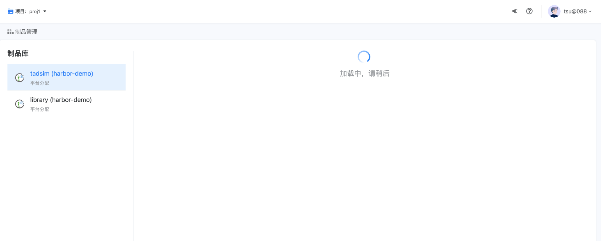

---
kind:
  - Troubleshooting
products:
  - Alauda Container Platform
  - Alauda DevOps
  - Alauda AI
  - Alauda Application Services
  - Alauda Service Mesh
  - Alauda Developer Portal
ProductsVersion:
  - 4.1.0,4.2.x
---
<!-- A type of document that involves encountering a fault, diagnosing it, performing root cause analysis, and providing solutions. -->

# devops制品库偶发加载异常

harbor页面偶发超时异常 节点到容器网络间歇性不通（curl测试时通时不通） 抓包显示源端发包到达但目的端未回包

## Cause
- 主机内核参数开启tcp_tw_recycle导致NAT网络环境异常

## Resolution
- 执行sysctl -w net.ipv4.tcp_tw_recycle=0关闭该参数

## [workaround]

## [Related Information]
**Screenshots**

- Environment: BKCI v3.8.1 虚拟机环境
- harbor-nginx
- tcp_tw_recycle
- NAT网络
- Pod IP
- Component: harbor
- Page ID: 140823489
- Original Title: devops制品库偶发加载异常
