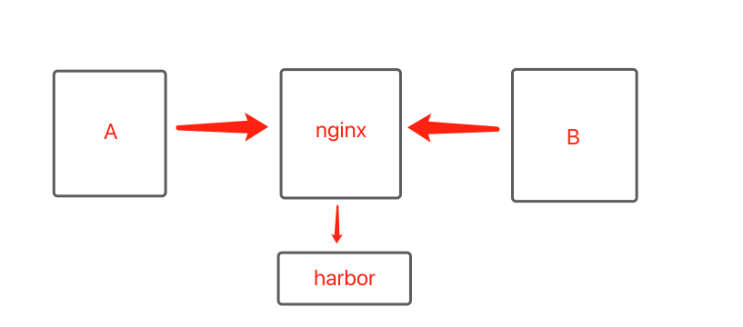
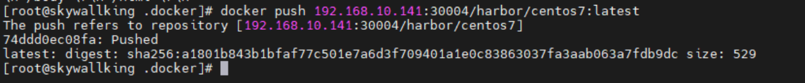

---
kind:
  - Troubleshooting
products:
  - Alauda Container Platform
  - Alauda DevOps
  - Alauda AI
  - Alauda Application Services
  - Alauda Service Mesh
  - Alauda Developer Portal
ProductsVersion:
  - 4.1.0,4.2.x
---
<!-- A type of document that involves encountering a fault, diagnosing it, performing root cause analysis, and providing solutions. -->

# 客户端跨网段访问harbor失败

关键词：客户端跨网段访问harbor失败

## Cause

## Resolution
- ## 解决方案
- 1，nginx代理配置
- 2，docker proxy 配置
- 无需重启docker

## [workaround]

## [Related Information]
**Screenshots**

- 30004
- //1.1.1.1
- 11
- 25
- 300
- 16
- 15
- /ke-hu-duan-kua-wang-duan-fang-wen-harborshi-bai/image2023-3-28_16-11-25.png
- /config.json
- /ke-hu-duan-kua-wang-duan-fang-wen-harborshi-bai/image2023-3-28_16-16-15.png
- Component: harbor
- Page ID: 140824914
- Original Title: 客户端跨网段访问harbor失败
