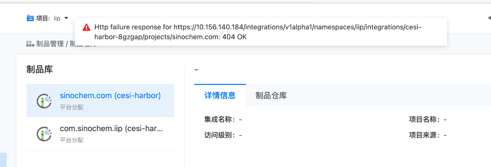

---
kind:
  - Troubleshooting
products:
  - Alauda Container Platform
  - Alauda DevOps
  - Alauda AI
  - Alauda Application Services
  - Alauda Service Mesh
  - Alauda Developer Portal
ProductsVersion:
  - 4.1.0,4.2.x
---
<!-- A type of document that involves encountering a fault, diagnosing it, performing root cause analysis, and providing solutions. -->

# 制品管理界面查看报错

Http failure response for https://10.156.140.184/integrations/v1alpha1/namespaces/iip/integrations/cesiharbor-8gzgap/projects/sinochem.com: 404 OK

## Cause
- Harbor项目被删除后未解除平台分配关系

## Resolution
- 在Harbor平台重新创建已删除的项目
- 在工具链管理中解除该项目的平台分配
- 删除工具链管理中的项目配置

## [workaround]

## [Related Information]
**Screenshots**

- Environment: devops 制品管理
- integrations/v1alpha1/namespaces
- harbor集成配置
- 工具链管理项目分配
- Component: harbor
- Page ID: 140825526
- Original Title: DevOps-制品管理界面查看报错
