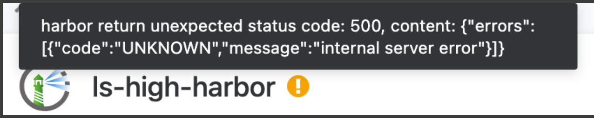
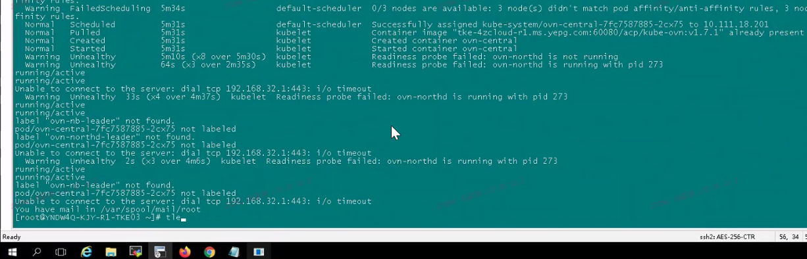
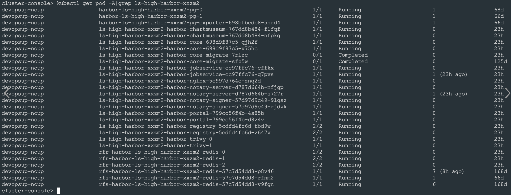

---
kind:
  - Troubleshooting
products:
  - Alauda Container Platform
  - Alauda DevOps
  - Alauda AI
  - Alauda Application Services
  - Alauda Service Mesh
  - Alauda Developer Portal
ProductsVersion:
  - 4.1.0,4.2.x
---
<!-- A type of document that involves encountering a fault, diagnosing it, performing root cause analysis, and providing solutions. -->

# harbor报错核心服务不可用

harbor服务无法访问，提示核心服务不可用 harbor-core日志报错：pq: cannot set transaction read-write mode during recovery

## Cause
- pg数据库发生主节点切换后，harbor-core仍访问旧的pg-leader

## Resolution
- 重启harbor-core组件

## [workaround]

## [Related Information]
**Screenshots**

- Environment: 通用
- harbor-core
- harbor-pg
- kube-apiserver
- pg-leader
- Component: harbor
- Page ID: 144902376
- Original Title: harbor报错核心服务不可用
