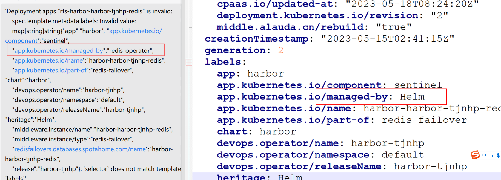

---
kind:
  - Troubleshooting
products:
  - Alauda Container Platform
  - Alauda DevOps
  - Alauda AI
  - Alauda Application Services
  - Alauda Service Mesh
  - Alauda Developer Portal
ProductsVersion:
  - 4.1.0,4.2.x
---
<!-- A type of document that involves encountering a fault, diagnosing it, performing root cause analysis, and providing solutions. -->

# 3.12.1

Redis哨兵节点未Ready Harbor相关资源标签不一致

## Cause
- app.kubernetes.io/managed-by标签被修改为redis-operator
- 数据服务Redis纳管机制与Harbor组件冲突

## Resolution
- 删除harbor-redis相关statefulset/deploy/service资源

## [workaround]

## [Related Information]
**Screenshots**

- Environment: v3.12.1集群启用数据服务业务视图功能
- harbor-redis
- redis-operator
- Statefulset
- Deployment
- Service
- app.kubernetes.io/managed-by
- Component: harbor
- Page ID: 149586679
- Original Title: 3.12.1-主机整体关机重启后-高可用harbor架构下redis启动失败-Redis 纳管导致的标签不一致导致
