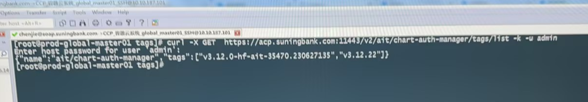
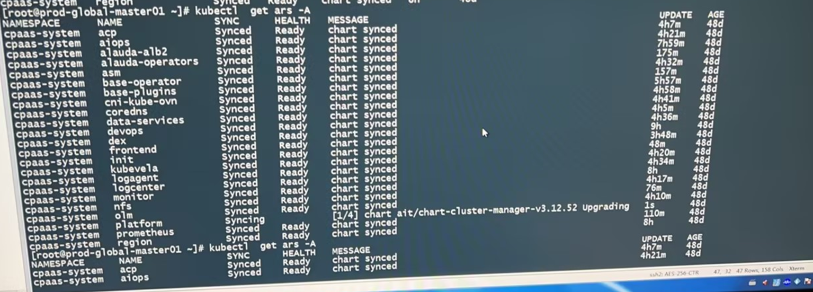

---
kind:
  - Troubleshooting
products:
  - Alauda Container Platform
  - Alauda DevOps
  - Alauda AI
  - Alauda Application Services
  - Alauda Service Mesh
  - Alauda Developer Portal
ProductsVersion:
  - 4.1.0,4.2.x
---
<!-- A type of document that involves encountering a fault, diagnosing it, performing root cause analysis, and providing solutions. -->

# 3.12.1

ars一直ready ,notready base-operator一直在改ars，导致ars反复重试 使用正确tag 2306271351上传镜像时报错400

## Cause
- 上传镜像时误删tag末尾数字导致错误tag 230627135被上传
- 首次修改prdb时使用了错误tag 2306271351导致残留AppRelease安装记录

## Resolution
- kubectl get rels -A | grep auth-manager
- kubectl delete rels -n cpaas-system xxxxxxxxxxxxx

## [workaround]

## [Related Information]
**Screenshots**

- Environment: 3.12.1
- AppRelease(rels)
- prdb配置
- chart-auth-manager镜像
- base-operator组件
- Component: Harbor
- Page ID: 152647897
- Original Title: 3.12.1-更改chart版本时ars反复重试
