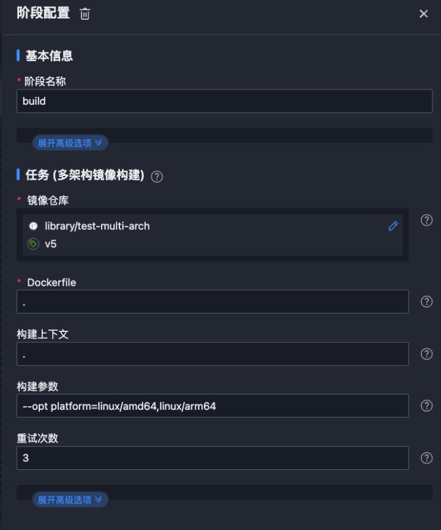
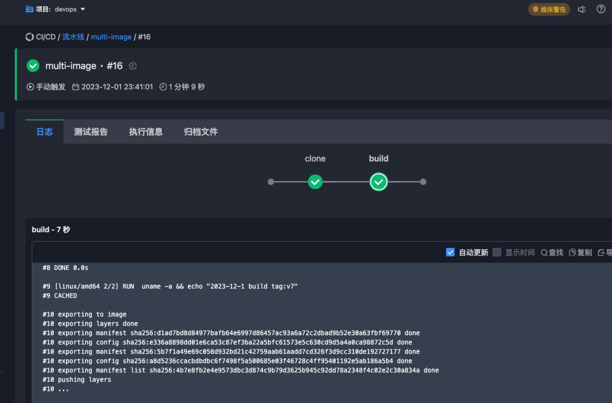

---
kind:
  - Troubleshooting
products:
  - Alauda Container Platform
  - Alauda DevOps
  - Alauda AI
  - Alauda Application Services
  - Alauda Service Mesh
  - Alauda Developer Portal
ProductsVersion:
  - 4.1.0,4.2.x
---
<!-- A type of document that involves encountering a fault, diagnosing it, performing root cause analysis, and providing solutions. -->

# 多架构镜像构建方案

构建多架构镜像失败 默认构建器不支持多架构 镜像未正确推送至仓库

## Cause
- 未安装buildx插件或版本过低
- 未创建支持多架构的buildx构建器
- containerd环境未正确配置buildkit
- 镜像仓库认证配置错误

## Resolution
- docker buildx create --name=<builder-name> --driver=docker-container
- buildctl build --frontend dockerfile.v0 --opt platform=linux/amd64,linux/arm64 --local context=. --local dockerfile=. --output type=image,name=<image>,push=true
- 配置~/.docker/config.json进行镜像仓库认证
- docker manifest create <merged-image> <arch-image1> <arch-image2> && docker manifest push <merged-image>

## [workaround]

## [Related Information]
**Screenshots**

- Environment: 3.12.x
- buildx
- buildkit
- containerd
- skopeo
- Jenkins
- Tekton
- ~/.docker/config.json
- Dockerfile
- deployment.yaml
- Component: harbor
- Page ID: 175277077
- Original Title: 多架构镜像构建方案
