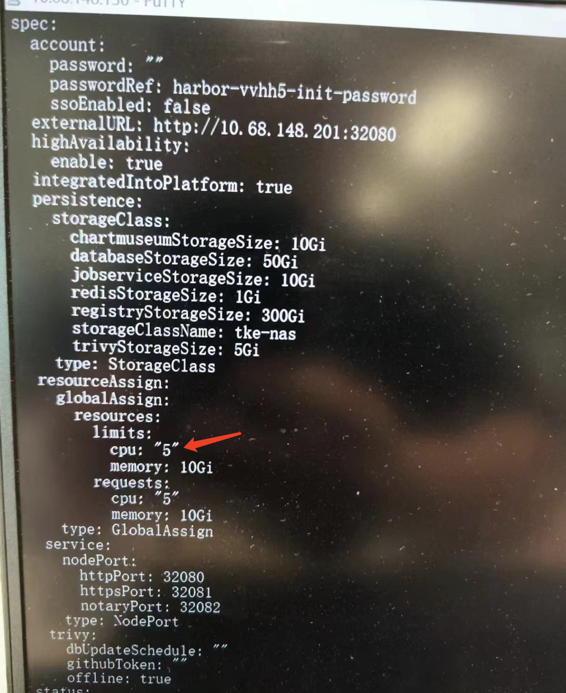

---
kind:
  - Troubleshooting
products:
  - Alauda Container Platform
  - Alauda DevOps
  - Alauda AI
  - Alauda Application Services
  - Alauda Service Mesh
  - Alauda Developer Portal
ProductsVersion:
  - 4.1.0,4.2.x
---
<!-- A type of document that involves encountering a fault, diagnosing it, performing root cause analysis, and providing solutions. -->

# harbor notary证书过期问题

JIRA Jira：

## Cause
- notary证书过期

## Resolution
- 通过kubectl edit修改Harbor资源参数触发operator更新自动续期证书

## [workaround]

## [Related Information]
**Screenshots**

- Environment: 3.10.2
- harbor资源
- notary组件
- operator
- Component: harbor
- Page ID: 196904856
- Original Title: Devops-harbor notary证书过期问题
