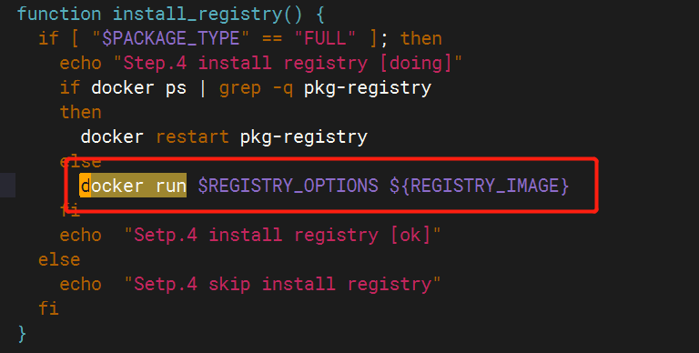
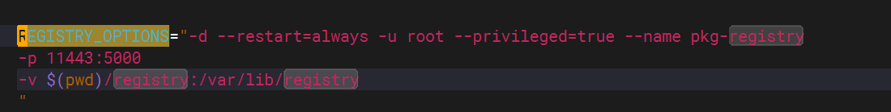
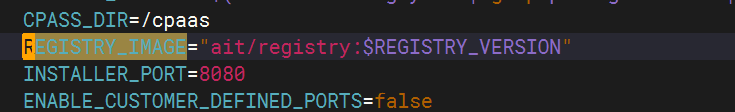
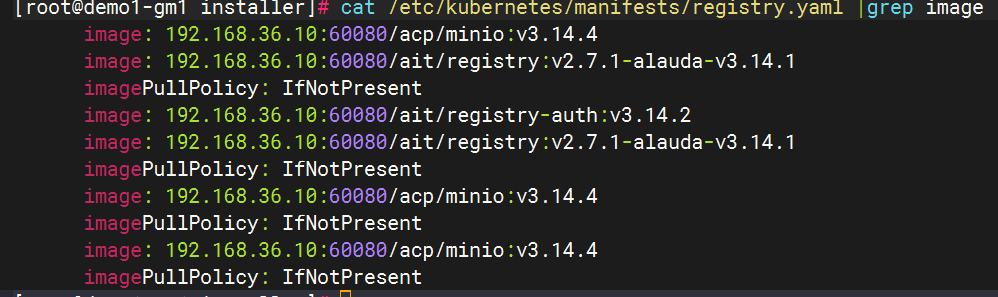

---
kind:
  - Troubleshooting
products:
  - Alauda Container Platform
  - Alauda DevOps
  - Alauda AI
  - Alauda Application Services
  - Alauda Service Mesh
  - Alauda Developer Portal
ProductsVersion:
  - 4.1.0,4.2.x
---
<!-- A type of document that involves encountering a fault, diagnosing it, performing root cause analysis, and providing solutions. -->

# 3.12以后registry三节点imagepullbackoff恢复

imagepullbackoff registry损坏

## Cause
- minio分布式存储高可用在3节点故障时无法满足3-1原则

## Resolution
- mv /cpaas/minio /cpaas/minio-back
- docker ps -a | grep registry | xargs docker rm -f
- docker run -d --restart=always -u root --privileged=true --name pkg-registry -p 11443:5000 -v $(pwd)/registry:/var/lib/registry ait/registry:xxxx
- 从pkg-registry拉取镜像并修改tag为本地仓库地址
- docker run --name mctmp --privileged --net=host --entrypoint=/bin/sh -v $PWD/registry:/registry ${REGISTRY_ENDPOINT}/3rdparty/mc:RELEASE.2020-09-03T00-08-28Z c 'mc alias --insecure set miniocluster http://x.x.x.x:9000 ${MINIO_ACCESS_KEY} ${MINIO_SECRET_KEY} && mc cp --insecure --recursive /registry/docker/ miniocluster/registry/docker'

## [workaround]

## [Related Information]
**Screenshots**

- Environment: 3.12
- registry
- minio
- 11443
- 60080
- 9000
- /cpaas/minio
- MINIO_ACCESS_KEY
- MINIO_SECRET_KEY
- setup.sh
- registry.yaml
- Component: Harbor
- Page ID: 199855412
- Original Title: 3.12以后registry三节点imagepullbackoff恢复
