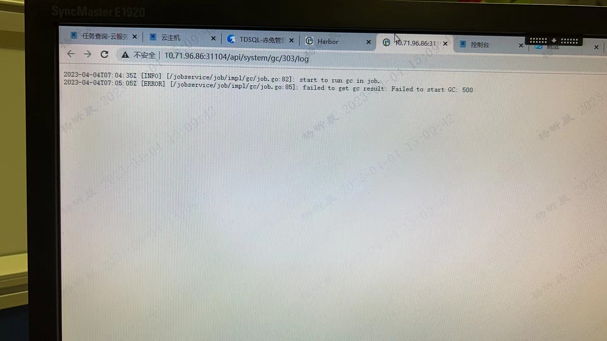
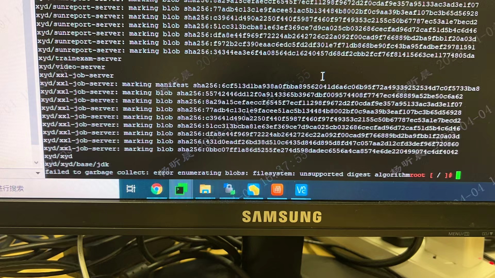

---
kind:
  - Troubleshooting
products:
  - Alauda Container Platform
  - Alauda DevOps
  - Alauda AI
  - Alauda Application Services
  - Alauda Service Mesh
  - Alauda Developer Portal
ProductsVersion:
  - 4.1.0,4.2.x
---
<!-- A type of document that involves encountering a fault, diagnosing it, performing root cause analysis, and providing solutions. -->

# 厦门

failed to garbage collect error enumerating blobs filesystem unsupported digest algorithm

## Cause
- Harbor 1.8旧版本无法识别新版本Docker产生的镜像摘要算法

## Resolution
- 升级Harbor版本至兼容新Docker算法的版本

## [workaround]

## [Related Information]
**Screenshots**

- Environment: Harbor 3.8.2
- harbor-core
- docker registry
- garbage collection
- digest algorithm
- Component: harbor
- Page ID: 202968310
- Original Title: Devops-厦门-harbor gc失败
