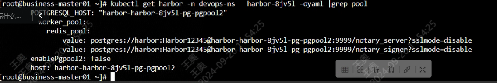

---
kind:
  - Troubleshooting
products:
  - Alauda Container Platform
  - Alauda DevOps
  - Alauda AI
  - Alauda Application Services
  - Alauda Service Mesh
  - Alauda Developer Portal
ProductsVersion:
  - 4.1.0,4.2.x
---
<!-- A type of document that involves encountering a fault, diagnosing it, performing root cause analysis, and providing solutions. -->

# harbor无法推送镜像，502 bad gateway

镜像仓库异常，无法推送镜像

## Cause
- 问题原因是harbor 的 pg ，pg实例里的pgpool被false了，导致pgpool的svc没了，打开pgpool后就好了，core连的是pgpool

## Resolution
- ## 解决方案
- 排查到harbor cr发现该部分pgpool2的配置为

## [workaround]

## [Related Information]
**Screenshots**

- 502
- /devops-harborwu-fa-tui-song-jing-xiang-502-bad-gateway/1726796813_99781_91d122_push_error.png
- /devops-harborwu-fa-tui-song-jing-xiang-502-bad-gateway/mceclip0_1726804434170_tum9g.png
- /devops-harborwu-fa-tui-song-jing-xiang-502-bad-gateway/mceclip1_1726804469571_erluo.png
- /devops-harborwu-fa-tui-song-jing-xiang-502-bad-gateway/mceclip0_1726812136119_880to.png
- Component: harbor
- Page ID: 234979955
- Original Title: Devops-harbor无法推送镜像，502 bad gateway
