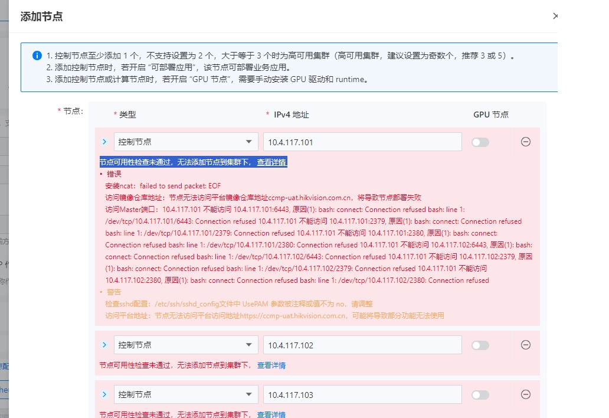

---
kind:
  - Troubleshooting
products:
  - Alauda Container Platform
  - Alauda DevOps
  - Alauda AI
  - Alauda Application Services
  - Alauda Service Mesh
  - Alauda Developer Portal
ProductsVersion:
  - 4.1.0,4.2.x
---
<!-- A type of document that involves encountering a fault, diagnosing it, performing root cause analysis, and providing solutions. -->

# 创建集群时节点可用性检查失败问题解决 【ncat 安装错误】

节点无法访问平台镜像仓库地址 `ccmp - uat.hikvision.com.cn` 访问 Master 端口（如 `10.4.117.101:6443`、`10.4.117.101:2379`、`10.4.117.101:2380`）时出现连接拒绝 提示检查 `sshd` 配置 `/etc/ssh/`

## Cause
- 用于测试端口的 `ncat` 二进制包未导入到业务集群

## Resolution
- 使用 `scp` 传输 `ncat` 二进制文件到节点：`scp /local/path/ncat user@10.4.117.101:/remote/path/`
- 若 `scp` 失败，改用 `sftp` 传输：`sftp user@10.4.117.101` → `put /local/path/ncat /remote/path/`
- 重新进行集群创建及节点添加操作

## [workaround]

## [Related Information]
**Screenshots**

- 6443
- 2379
- 2380
- /etc/ssh/
- ncat
- scp
- sftp
- Component: Harbor
- Page ID: 250446982
- Original Title: 基础架构-部署- 创建集群时节点可用性检查失败问题解决 【ncat 安装错误】
