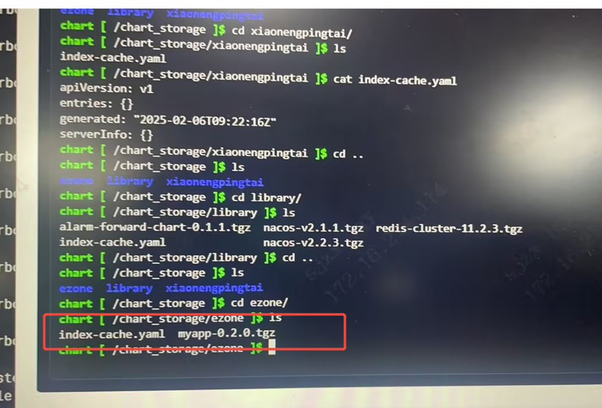
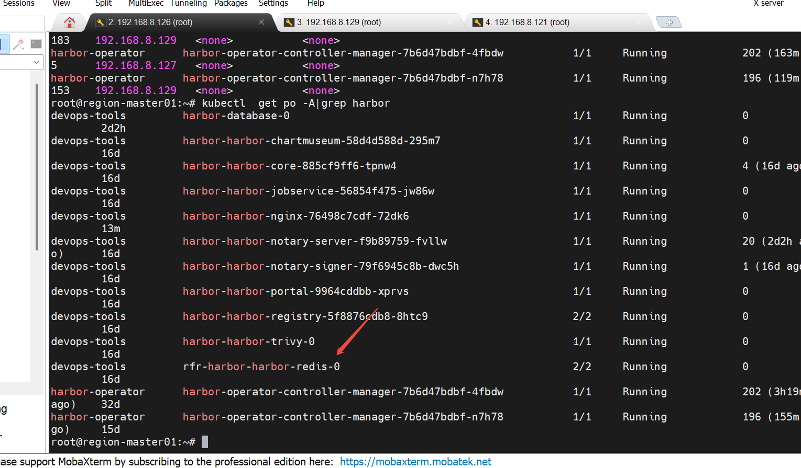
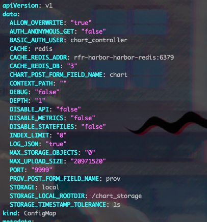

---kind:   - Troubleshootingproducts:    - Alauda Container Platform   - Alauda DevOps   - Alauda AI   - Alauda Application Services   - Alauda Service Mesh   - Alauda Developer PortalProductsVersion:   - 4.1.0,4.2.x---<!-- A type of document that involves encountering a fault, diag...it, performing root cause analysis, and providing solutions. --># harbor仓库的chart包删除不了无法在Harbor界面删除chart包 前端显示残留但后端存储已删除 重启Redis Pod无效## Cause- chartmuseum对含多个连字符的包名处理缺陷- chart包命名不符合社区规范（含两个以上-）## Resolution- 升级Harbor到2.6.4版本- 规范chart包命名格式为<name>-<version>.tgz## [workaround]- redis-cli连接Redis并执行：select 3- 删除对应仓库key：del <key>- 删除chartmuseum的/chart_storage/<registry>/index-cache.yaml中残留条目## [Related Information]**Screenshots**- Environment: Harbor 3.12.2- redis- chartmuseum- index-cache.yaml- /chart_storage/<registry>- del命令- Component: harbor- Page ID: 268536218- Original Title: Devops-harbor仓库的chart包删除不了-101170