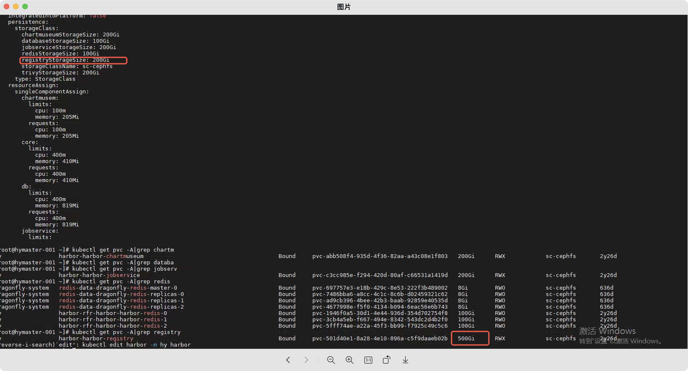
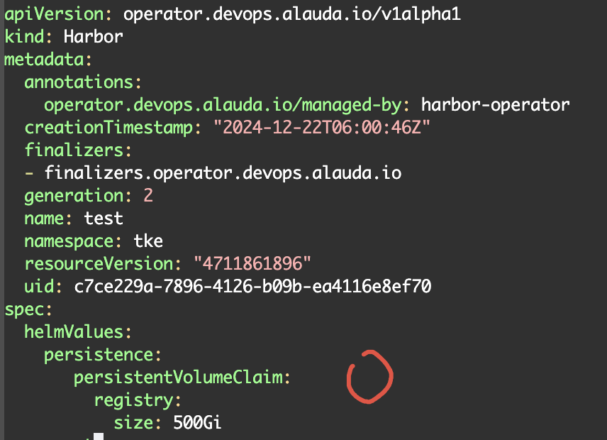

---
kind:
  - Troubleshooting
products:
  - Alauda Container Platform
  - Alauda DevOps
  - Alauda AI
  - Alauda Application Services
  - Alauda Service Mesh
  - Alauda Developer Portal
ProductsVersion:
  - 4.1.0,4.2.x
---
<!-- A type of document that involves encountering a fault, diagnosing it, performing root cause analysis, and providing solutions. -->

# harbor notary

harbor notary pod频繁重启 2025-03-03T09:47:28Z is after 2025-02-28T03:09:24Z证书过期报错

## Cause
- operator生成的harbor notary组件tls证书有效期仅一年且未自动更新

## Resolution
- kubectl edit harbor -n xxx [harbor资源名称] 调整实例cpu/memory触发chart更新证书
- 若pod异常删除需检查registry pvc实际大小与CR声明是否一致，通过helmValues修正pvc配置

## [workaround]

## [Related Information]
**Screenshots**

- Environment: 3.10.1
- harbor-operator
- harbor CR资源
- registry pvc配置
- devops-tools-operator日志
- Component: harbor
- Page ID: 268536225
- Original Title: Devops-harbor notary-server 证书到期
