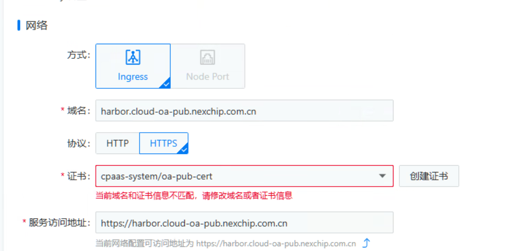
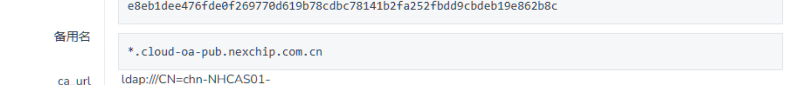
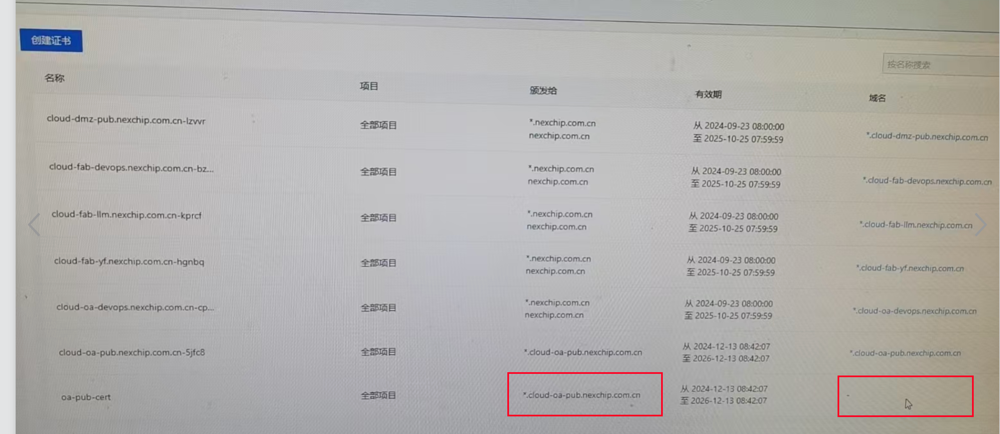

---kind:   - Troubleshootingproducts:    - Alauda Container Platform   - Alauda DevOps   - Alauda AI   - Alauda Application Services   - Alauda Service Mesh   - Alauda Developer PortalProductsVersion:   - 4.1.0,4.2.x---<!-- A type of document that involves encountering a fault, diag...it, performing root cause analysis, and providing solutions. --># 应用证书不安全问题应用证书提示不安全 证书内容和域名不匹配告警 自签证书无法显示'颁发给'字段## Cause- Harbor实例配置了泛域名证书但实际需要精确域名证书## Resolution- 更换颁发对象(Subject Alternative Name/Certificate Subject)与访问域名完全匹配的证书- 通过openssl x509 -in cert.pem -text -noout验证证书SAN/CN字段## [workaround]## [Related Information]**Screenshots**- Environment: 3.x- Harbor- 泛域名证书- 精确域名- SAN(Subject Alternative Name)- CN(Common Name)- 证书管理- Component: harbor- Page ID: 269780103- Original Title: Devops-应用证书不安全问题-100093