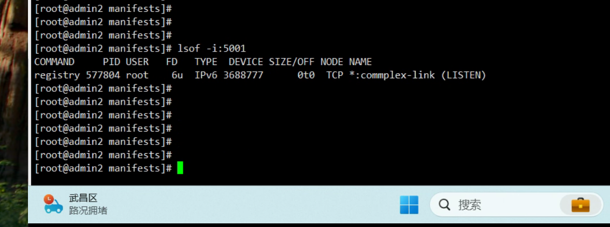
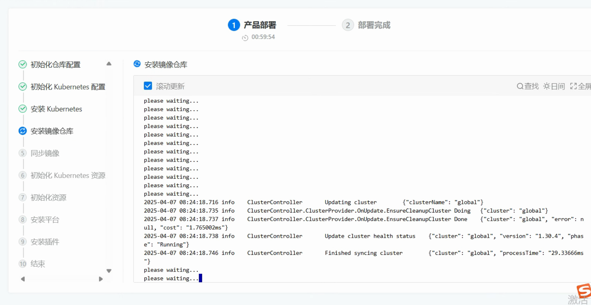
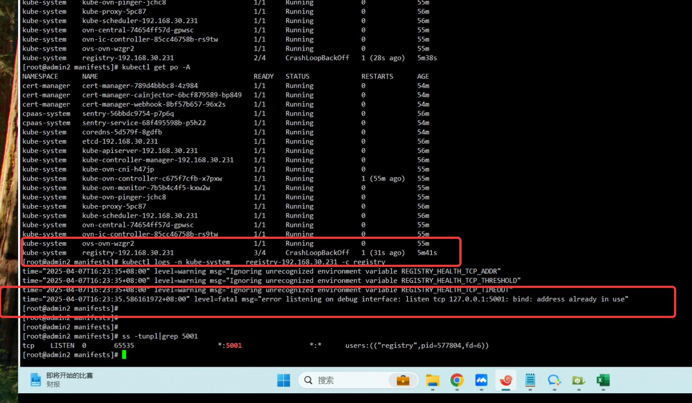
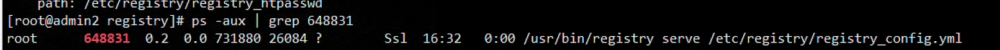
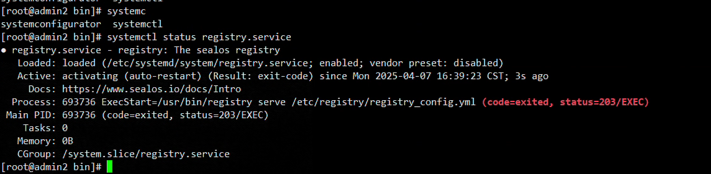

---
kind:
  - Troubleshooting
products:
  - Alauda Container Platform
  - Alauda DevOps
  - Alauda AI
  - Alauda Application Services
  - Alauda Service Mesh
  - Alauda Developer Portal
ProductsVersion:
  - 4.1.0,4.2.x
---
<!-- A type of document that involves encountering a fault, diagnosing it, performing root cause analysis, and providing solutions. -->

# 平台部署异常

平台部署卡在安装镜像仓库阶段 镜像仓库pod处于crash状态 端口对应的进程kill后重启pod无效

## Cause
- 宿主机已存在registry服务导致端口冲突

## Resolution
- systemctl stop registry && systemctl disable registry

## [workaround]

## [Related Information]
**Screenshots**

- Environment: 3.18.0
- registry服务
- 镜像仓库pod
- Component: Harbor
- Page ID: 274694717
- Original Title: 基础架构-平台部署异常-105013
