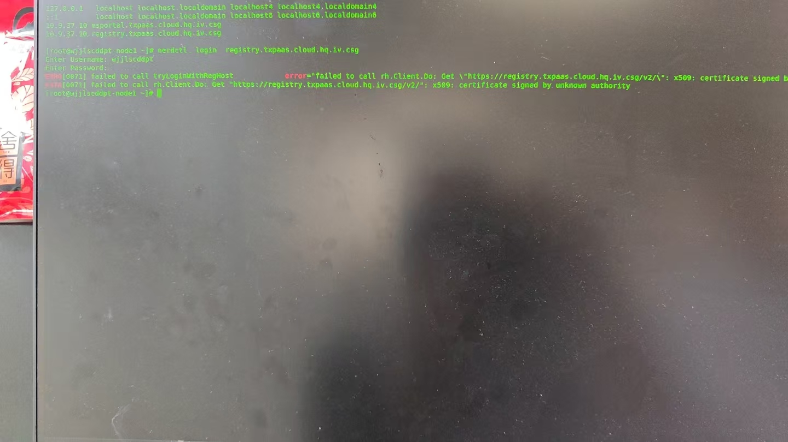

---
kind:
  - Troubleshooting
products:
  - Alauda Container Platform
  - Alauda DevOps
  - Alauda AI
  - Alauda Application Services
  - Alauda Service Mesh
  - Alauda Developer Portal
ProductsVersion:
  - 4.1.0,4.2.x
---
<!-- A type of document that involves encountering a fault, diagnosing it, performing root cause analysis, and providing solutions. -->

# nerdctl 无法登录harbor仓库

nerdctl 无法登录harbor仓库

## Cause
- 镜像仓库未被添加为可信任的镜像仓库

## Resolution
- sudo mkdir -p /etc/containerd/certs.d/harbor.example.com
- 创建hosts.toml配置文件并配置http/https的host规则
- sudo systemctl restart containerd

## [workaround]
- nerdctl --insecure-registry registry.topascloud.mg.io login -u <用户名> -p <密码>

## [Related Information]
**Screenshots**

- Environment: 3.14.2
- harbor.example.com
- /etc/containerd/certs.d/harbor.example.com/hosts.toml
- containerd
- Component: harbor
- Page ID: 274694744
- Original Title: Devops-nerdctl 无法登录harbor仓库-104593
