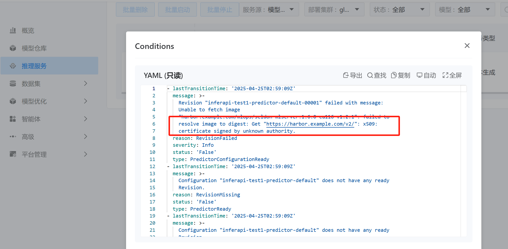

---
kind:
  - Troubleshooting
products:
  - Alauda Container Platform
  - Alauda DevOps
  - Alauda AI
  - Alauda Application Services
  - Alauda Service Mesh
  - Alauda Developer Portal
ProductsVersion:
  - 4.1.0,4.2.x
---
<!-- A type of document that involves encountering a fault, diagnosing it, performing root cause analysis, and providing solutions. -->

# 推理服务报错拉取镜像509

拉取镜像报错509 没有创建任何Pod

## Cause
- Knative未配置跳过指定镜像仓库的标签解析

## Resolution
- 修改knative-serving命名空间下的config-deployment ConfigMap，添加registries-skipping-tag-resolving: <仓库>配置

## [workaround]

## [Related Information]
**Screenshots**

- Environment: Containerd v3.18非安全镜像仓库环境
- config-deployment
- registries-skipping-tag-resolving
- knative-serving命名空间
- Component: Harbor
- Page ID: 281411747
- Original Title: 推理服务报错拉取镜像509
