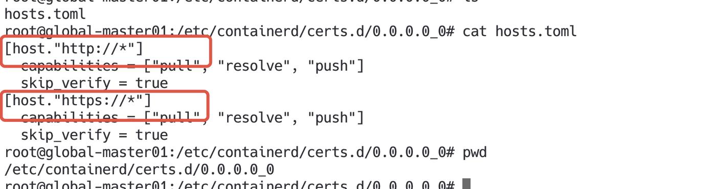

---kind:   - Troubleshootingproducts:    - Alauda Container Platform   - Alauda DevOps   - Alauda AI   - Alauda Application Services   - Alauda Service Mesh   - Alauda Developer PortalProductsVersion:   - 4.1.0,4.2.x---<!-- A type of document that involves encountering a fault, diag...it, performing root cause analysis, and providing solutions. --># 业务集群部署时，下载镜像非常慢容器镜像拉取耗时异常 80端口连接超时后切换443端口## Cause- 容器运行时默认配置了80端口优先的尝试顺序## Resolution- 修改容器运行时配置强制使用443端口- 在/etc/docker/daemon.json添加"registry-mirrors"配置- 修改/etc/containerd/config.toml中的registry配置## [workaround]## [Related Information]**Screenshots**- Environment: v4.0.1- 80- 443- /etc/docker/daemon.json- /etc/containerd/config.toml- registry-mirrors- registry配置- Component: Harbor- Page ID: 292946012- Original Title: 基础架构-业务集群部署时，下载镜像非常慢-108739-zh