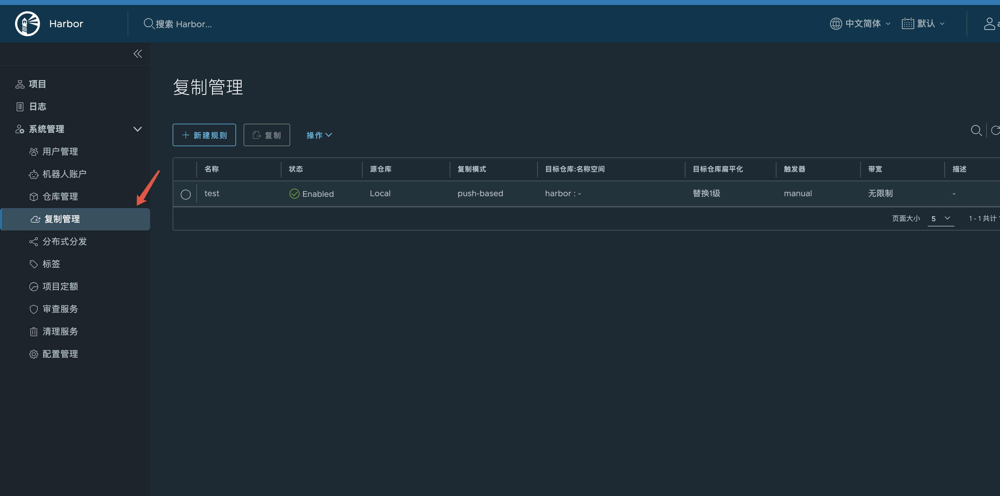

---kind:   - Troubleshootingproducts:    - Alauda Container Platform   - Alauda DevOps   - Alauda AI   - Alauda Application Services   - Alauda Service Mesh   - Alauda Developer PortalProductsVersion:   - 4.1.0,4.2.x---<!-- A type of document that involves encountering a fault, diag...it, performing root cause analysis, and providing solutions. --># 单点harbor 迁移ha harbor 的方案JIRA Jira：## Cause- 单点Harbor存在单点故障风险，无法满足生产环境的高可用需求## Resolution- 部署HA Harbor集群（Core、JobService、Registry、Database等高可用模式）- 使用Harbor迁移工具或手动导出导入数据- 镜像迁移：`docker pull`源镜像，`docker push`到目标仓库- 直接复制存储后端数据（确保Registry处于只读状态）- 更新DNS/负载均衡配置，切换流量到新集群- 执行功能测试和性能测试- 监控新集群运行状态## [workaround]## [Related Information]**Screenshots**- Environment: v3.16.1- Core- JobService- Registry- Database- 文件系统- S3- PostgreSQL集群- 负载均衡- DNS- Harbor迁移工具- Component: harbor- Page ID: 302286200- Original Title: Devops-单点harbor 迁移ha harbor 的方案-110602-zh