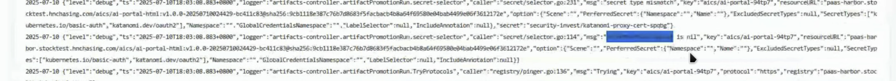
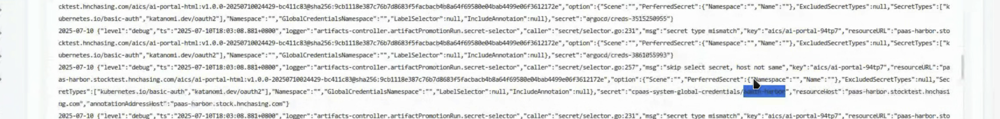
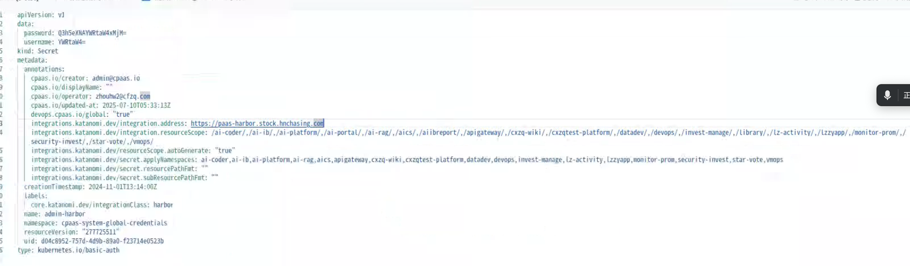

---kind:   - Troubleshootingproducts:    - Alauda Container Platform   - Alauda DevOps   - Alauda AI   - Alauda Application Services   - Alauda Service Mesh   - Alauda Developer PortalProductsVersion:   - 4.1.0,4.2.x---<!-- A type of document that involves encountering a fault, diag...it, performing root cause analysis, and providing solutions. --># 镜像晋级报错unauthorized，昨天还可以Error getting artifact details: errors: [{"code":"UNAUTHORIZED","message":"unauthorized"}]## Cause- 测试harbor与生产harbor的集成卡片使用了同一个凭据## Resolution- 为测试harbor重新生成新的凭据并更新集成卡片配置## [workaround]## [Related Information]**Screenshots**- Environment: 3.16.2- harbor集成卡片- katanomi-artifact日志- 凭据配置- Component: harbor- Page ID: 314638711- Original Title: Devops-镜像晋级报错unauthorized，昨天还可以-112693