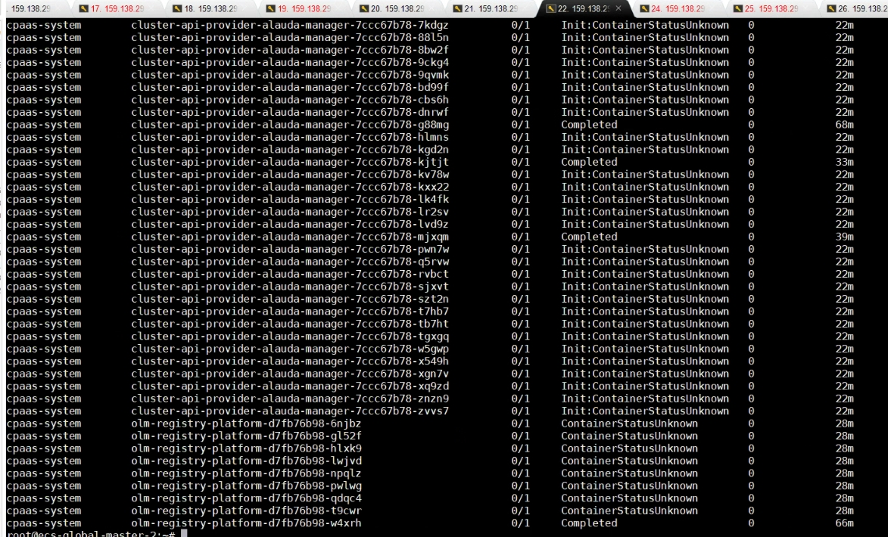
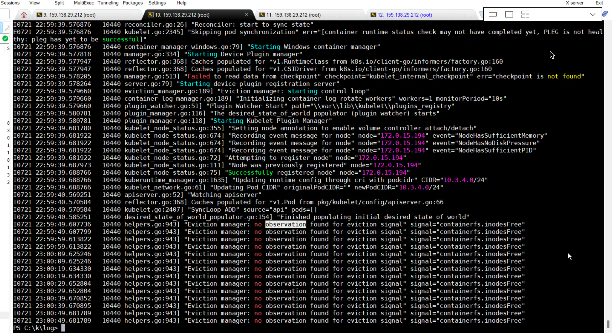
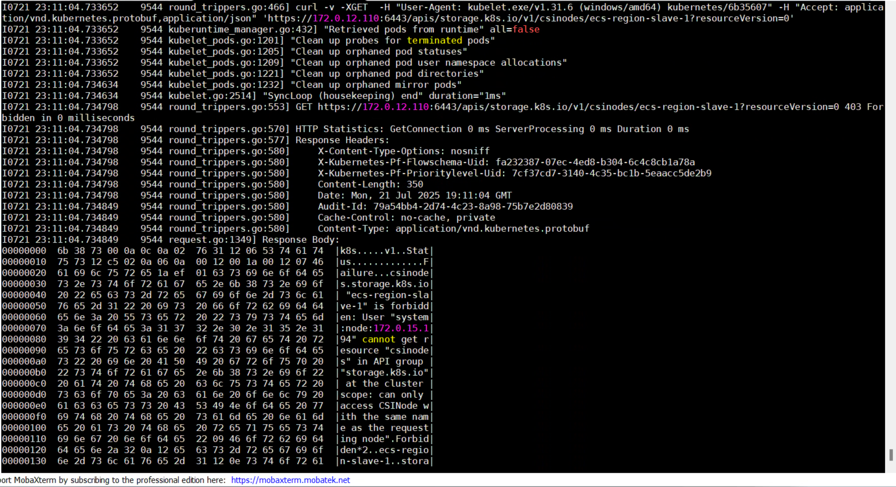
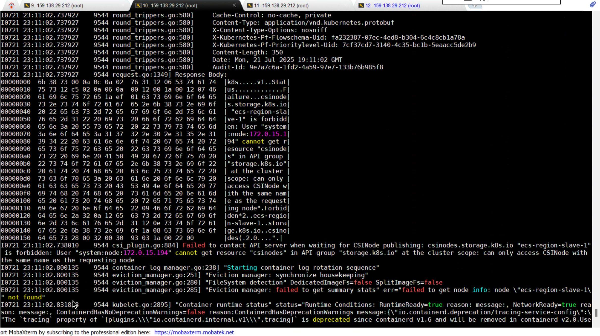

---
kind:
  - Troubleshooting
products:
  - Alauda Container Platform
  - Alauda DevOps
  - Alauda AI
  - Alauda Application Services
  - Alauda Service Mesh
  - Alauda Developer Portal
ProductsVersion:
  - 4.1.0,4.2.x
---
<!-- A type of document that involves encountering a fault, diagnosing it, performing root cause analysis, and providing solutions. -->

# 接入业务集群失败

global集群出问题，重新部署后，将业务集群添加到新 global 集群上，但是卡在EnsureWaitClusterModuleReady 阶段，global集群上看到很多api-provider-xxx的pod 运行失败

## Cause

## Resolution
- 在新global接入集群前未删除tke cm，清理删除后，客户修复了旧global，还使用旧global尝试恢复集群，检查发现cni等组件已经被卸载，沟通后在新global进行创建业务集群，业务集群包含两台wind节点，操作系统 windows 2022，添加时发现add node后还是会去找旧global的135镜像
- ## 解决方案

## [workaround]

## [Related Information]
**Screenshots**

- 1800
- 2022
- /ji-chu-jia-gou-chan-pin-sheng-ming-zhou-qi-guan-li-bu-shu-jie-ru-ye-wu-ji-qun-sh/1753108990_99781_f91ae8_1.png
- /ji-chu-jia-gou-chan-pin-sheng-ming-zhou-qi-guan-li-bu-shu-jie-ru-ye-wu-ji-qun-sh/mceclip4_1753129537632_08jvs.png
- /ji-chu-jia-gou-chan-pin-sheng-ming-zhou-qi-guan-li-bu-shu-jie-ru-ye-wu-ji-qun-sh/mceclip3_1753129530842_130rs.png
- /ji-chu-jia-gou-chan-pin-sheng-ming-zhou-qi-guan-li-bu-shu-jie-ru-ye-wu-ji-qun-sh/mceclip2_1753129525359_egctg.png
- Component: Harbor
- Page ID: 324174082
- Original Title: 基础架构-产品生命周期管理-部署-接入业务集群失败-1800
