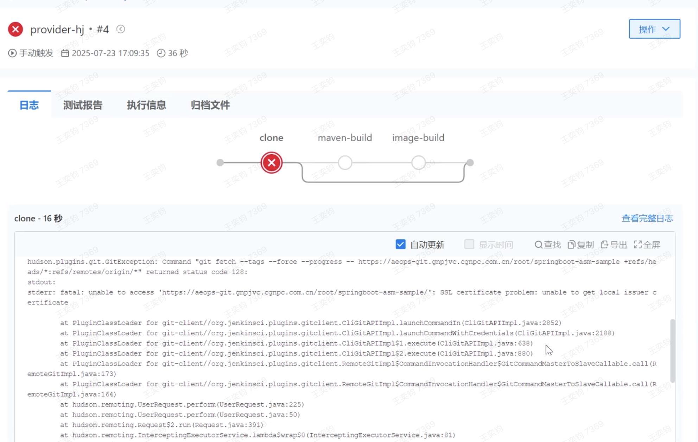

---kind:   - Troubleshootingproducts:    - Alauda Container Platform   - Alauda DevOps   - Alauda AI   - Alauda Application Services   - Alauda Service Mesh   - Alauda Developer PortalProductsVersion:   - 4.1.0,4.2.x---<!-- A type of document that involves encountering a fault, diag...it, performing root cause analysis, and providing solutions. --># jenkins gitclone 的时候报证书错误JIRA Jira：## Cause## Resolution- 2、需要写docker file- 3、重新docker tag，push到原有镜像仓库- 4、在页面创建自定义构建节点，镜像使用新的tag的名称- ## 解决方案## [workaround]## [Related Information]**Screenshots**- jenkins- /devops-jenkins-gitclone-de-shi-hou-bao-zheng-shu-cuo-wu-113611/1753262022_99781_c2f41b_213-430c-b78f-30954080cd2c.png- /jre/lib/security/cacerts- Component: Harbor- Page ID: 324174508- Original Title: Devops-jenkins gitclone 的时候报证书错误-113611