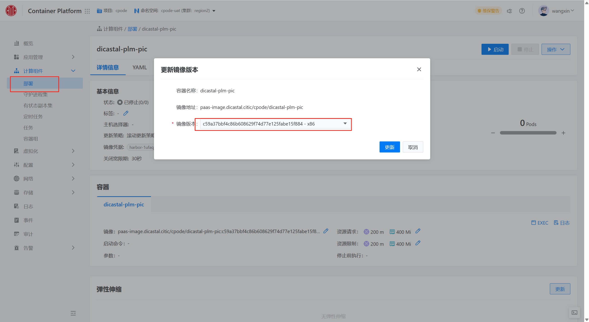
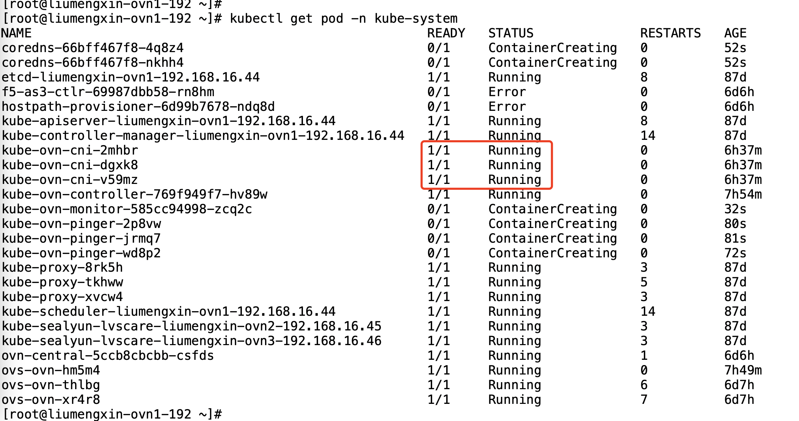
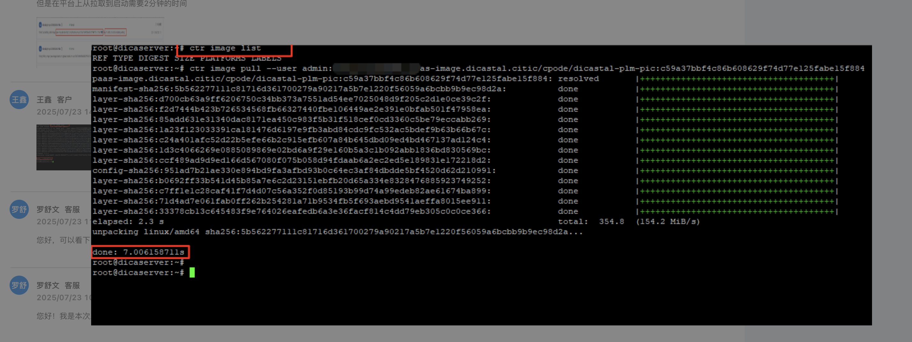
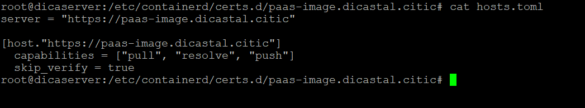
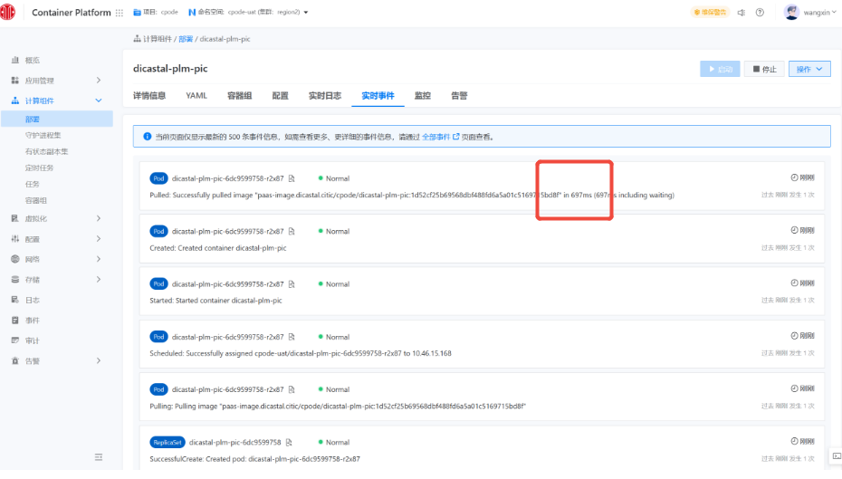
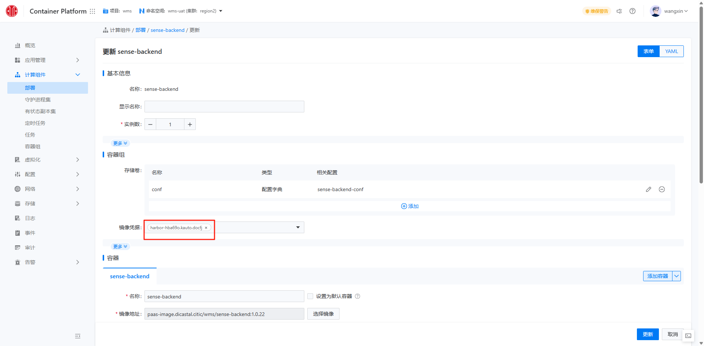
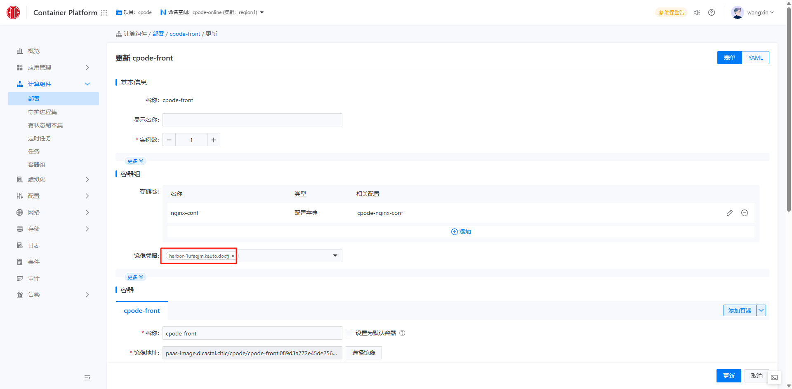

---
kind:
  - Troubleshooting
products:
  - Alauda Container Platform
  - Alauda DevOps
  - Alauda AI
  - Alauda Application Services
  - Alauda Service Mesh
  - Alauda Developer Portal
ProductsVersion:
  - 4.1.0,4.2.x
---
<!-- A type of document that involves encountering a fault, diagnosing it, performing root cause analysis, and providing solutions. -->

# harbor在正式集群，从测试集群拉取镜像速度很慢

测试集群容器平台部署应用时拉取镜像需2分钟以上 测试集群计算节点手动拉取同一镜像仅需几秒 所有测试集群计算节点均存在此问题

## Cause
- containerd配置文件中HTTP配置块在HTTPS之前
- 测试环境访问Harbor域名时HTTP协议连接被阻塞导致超时

## Resolution
- 修改containerd配置文件，将HTTPS配置块置于HTTP之前
- 重启containerd服务: systemctl restart containerd
- 或配置网络策略限制测试节点访问Harbor的80端口

## [workaround]

## [Related Information]
**Screenshots**
如图可看到该计算节点上之前是不存在此镜像的。
就是在部署这里手动更新，更多的时候是通过DevOps自动发布，但镜像拉取这部分和手动的效果和执行时长是一致的
下图是正式环境的集群，拉取镜像就很快

- Environment: Harbor 3.18.1
- /etc/containerd/config.toml
- registry.config.toml
- harbor_https_port
- image_pull_secrets
- Component: harbor
- Page ID: 324174585
- Original Title: 基础架构-产品组件-harbor在正式集群，从测试集群拉取镜像速度很慢-113521
