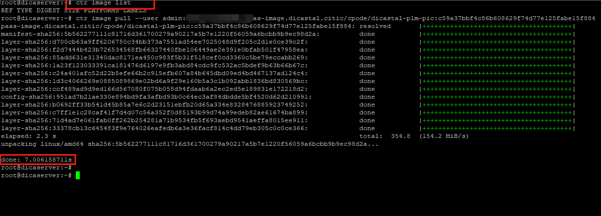

---kind:   - Troubleshootingproducts:    - Alauda Container Platform   - Alauda DevOps   - Alauda AI   - Alauda Application Services   - Alauda Service Mesh   - Alauda Developer PortalProductsVersion:   - 4.1.0,4.2.x---<!-- A type of document that involves encountering a fault, diag...it, performing root cause analysis, and providing solutions. --># harbor在正式集群，从测试集群拉取镜像速度很慢从测试集群平台部署应用时拉取镜像耗时2分钟以上 测试集群计算节点手动拉取同一镜像仅需几秒 所有测试集群节点均存在此问题## Cause- containerd默认配置优先尝试http协议访问harbor- 测试环境访问harbor http端口存在连接延迟## Resolution- 修改containerd 配置文件 /etc/containerd/config.toml- 调整registry配置顺序为https优先: [[plugins."io.containerd.grpc.v1.cri".registry.configs]] 中https配置需在http前- 重启containerd服务: systemctl restart containerd## [workaround]- 在测试环境节点限制对harbor域名的80端口访问## [Related Information]**Screenshots**如图可看到该计算节点上之前是不存在此镜像的。就是在部署这里手动更新，更多的时候是通过DevOps自动发布，但镜像拉取这部分和手动的效果和执行时长是一致的下图是正式环境的集群，拉取镜像就很快- Environment: Harbor 3.18.1- containerd/config.toml- nerdctl- ctr- harbor https配置- registry镜像凭据- Component: harbor- Page ID: 324174585- Original Title: 基础架构-产品组件-harbor在正式集群，从测试集群拉取镜像速度很慢-113521