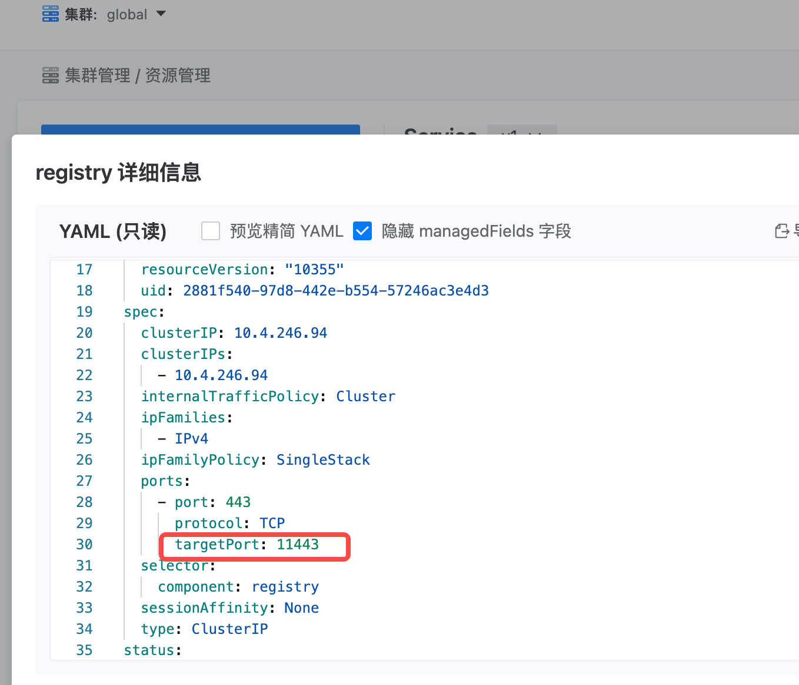

---kind:   - Troubleshootingproducts:    - Alauda Container Platform   - Alauda DevOps   - Alauda AI   - Alauda Application Services   - Alauda Service Mesh   - Alauda Developer PortalProductsVersion:   - 4.1.0,4.2.x---<!-- A type of document that involves encountering a fault, diag...it, performing root cause analysis, and providing solutions. --># 新建集群失败新建集群失败，镜像仓库地址端口错误（80而非60080）## Cause- global集群registry服务端口配置错误导致业务集群获取错误端口## Resolution- kubectl edit svc registry -n global- 将registry服务端口从11443修改为60080- 验证业务集群获取的镜像仓库地址端口已变更## [workaround]## [Related Information]**Screenshots**- Environment: 3.18.1- registry服务- 60080端口- 80端口- global集群配置- Component: Harbor- Page ID: 330466129- Original Title: 基础架构-产品生命周期管理-部署-新建集群失败-114946