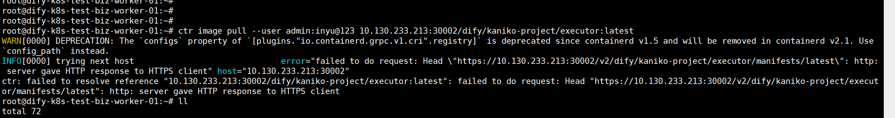
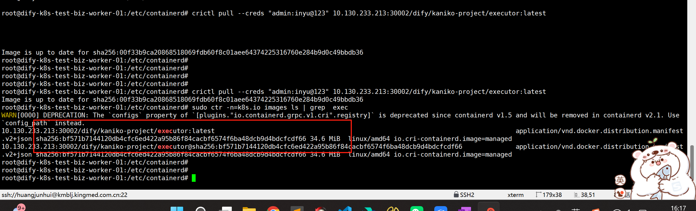

---kind:   - Troubleshootingproducts:    - Alauda Container Platform   - Alauda DevOps   - Alauda AI   - Alauda Application Services   - Alauda Service Mesh   - Alauda Developer PortalProductsVersion:   - 4.1.0,4.2.x---<!-- A type of document that involves encountering a fault, diag...it, performing root cause analysis, and providing solutions. --># contained配置harbor仓库使用ctr拉取镜像报错## Cause- ctr默认使用https协议连接仓库，而目标harbor仓库为http服务## Resolution- 使用crictl pull命令替代ctr pull拉取镜像## [workaround]## [Related Information]**Screenshots**- Environment: Harbor 3.18.1- ctr- crictl- http://10.130.233.213:30002- Component: harbor- Page ID: 330466197- Original Title: Devops-工具链-Harbor-contained配置harbor仓库-114886