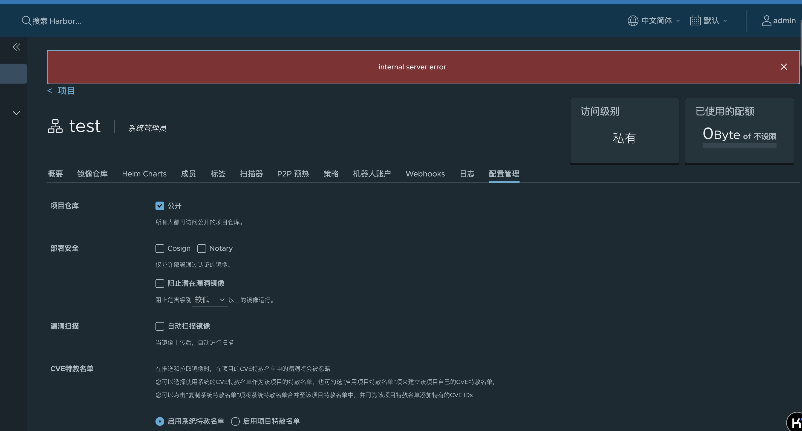
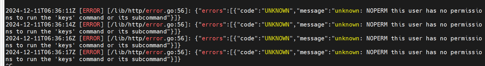
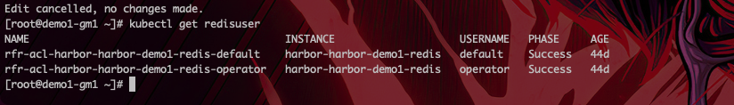
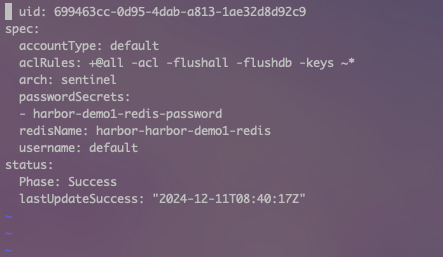
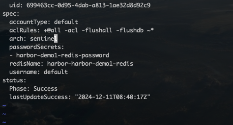

---
kind:
  - Troubleshooting
products:
  - Alauda Container Platform
  - Alauda DevOps
  - Alauda AI
  - Alauda Application Services
  - Alauda Service Mesh
  - Alauda Developer Portal
ProductsVersion:
  - 4.1.0,4.2.x
---
<!-- A type of document that involves encountering a fault, diagnosing it, performing root cause analysis, and providing solutions. -->

# harbor切换私有仓库功能报错internal server error

修改项目权限页面报错：internal server error harbor core日志显示redis不支持keys指令

## Cause
- harbor连接的redis实例ACL配置限制了keys指令

## Resolution
- 在redis部署的namespace下修改default redisuser配置，去除"-keys"配置
- 检查redis ACL配置确保允许keys指令（参考：https://redis.io/docs/latest/operate/oss_and_stack/management/security/acl/）

## [workaround]

## [Related Information]
**Screenshots**

- Environment: Harbor 3.18/3.20/4.0
- harbor core
- redis
- 项目权限配置页面
- keys指令
- redis ACL配置
- Component: harbor
- Page ID: 342670815
- Original Title: Devops-harbor切换私有仓库功能报错internal server error
