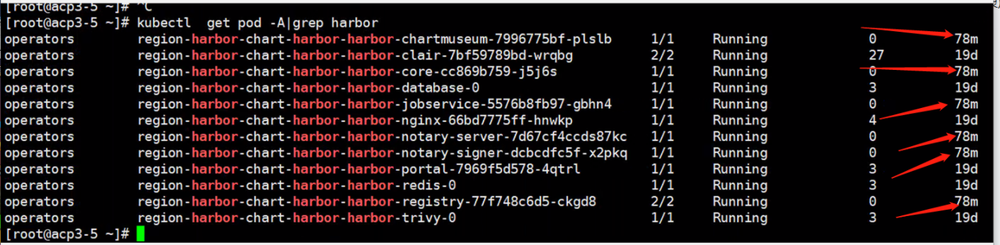
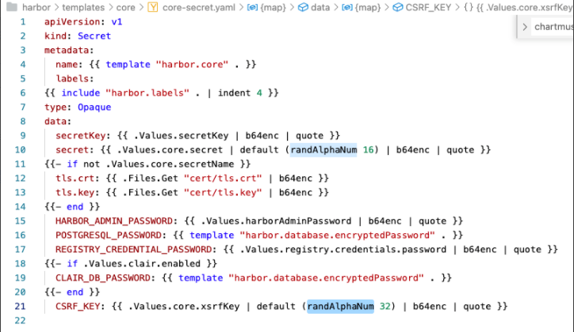
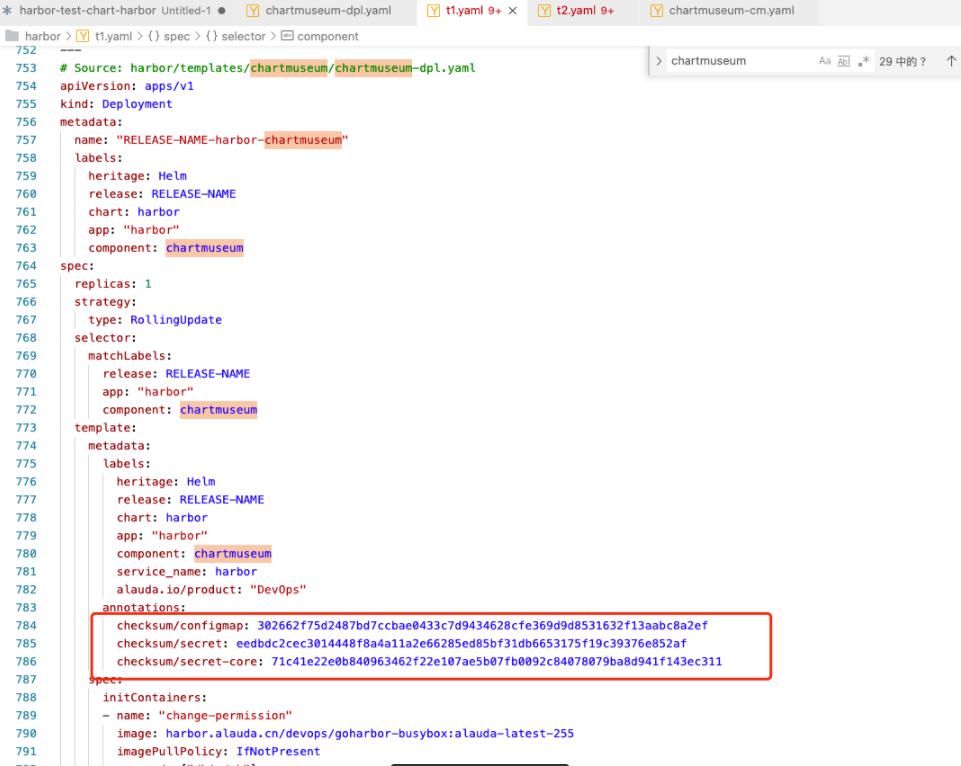
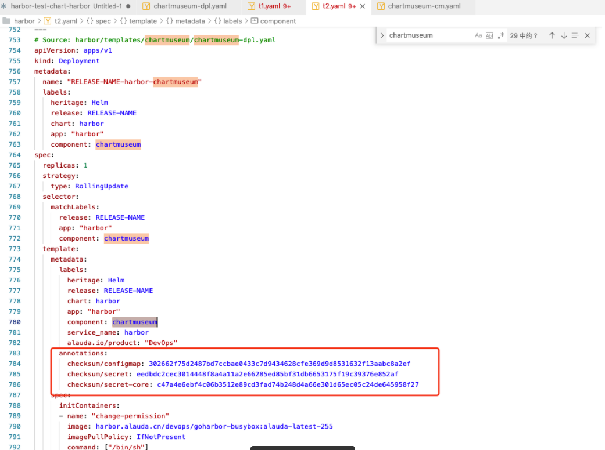

---
kind:
  - Troubleshooting
products:
  - Alauda Container Platform
  - Alauda DevOps
  - Alauda AI
  - Alauda Application Services
  - Alauda Service Mesh
  - Alauda Developer Portal
ProductsVersion:
  - 4.1.0,4.2.x
---
<!-- A type of document that involves encountering a fault, diagnosing it, performing root cause analysis, and providing solutions. -->

# 0

ars同步到harbor时触发自动重启

## Cause
- harbor组件在同步过程中存在资源竞争或配置冲突

## Resolution
- 给deploy资源增加skip-sync字段
- 给apprelease添加annotations: interval-sync: "false"

## [workaround]

## [Related Information]
**Screenshots**

- Environment: harbor 3.0-3.3版本
- deploy资源
- apprelease annotations
- interval-sync
- skip-sync
- Component: harbor
- Page ID: 94885858
- Original Title: 0-3.0+版本harbor为ars管理出现自动重启
